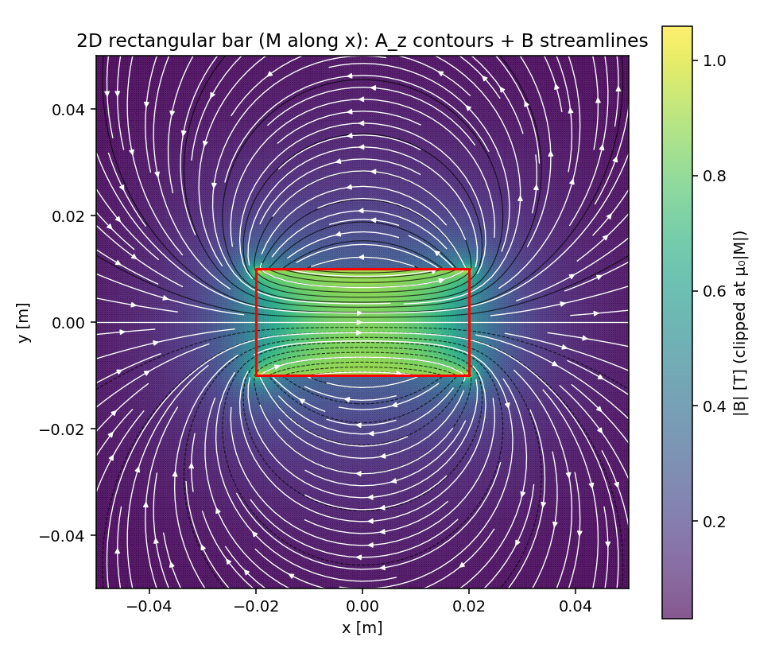
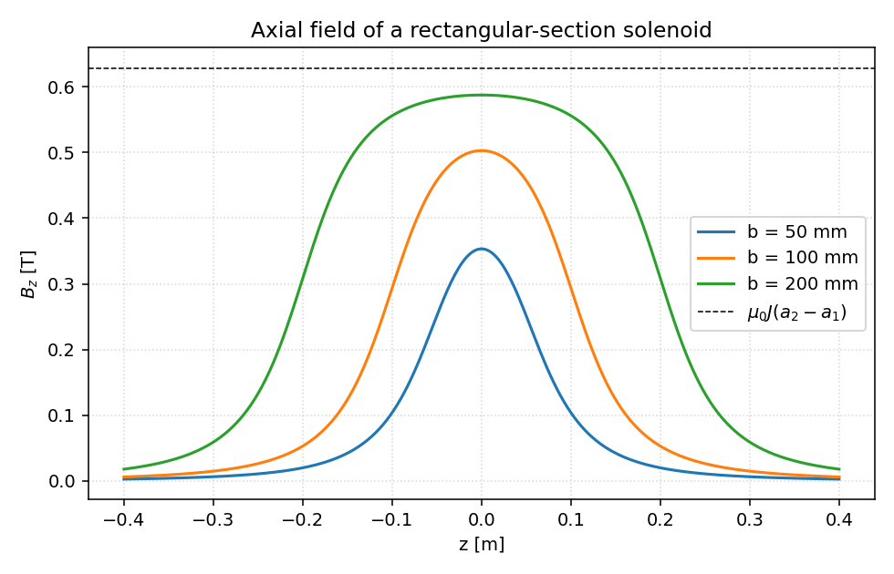
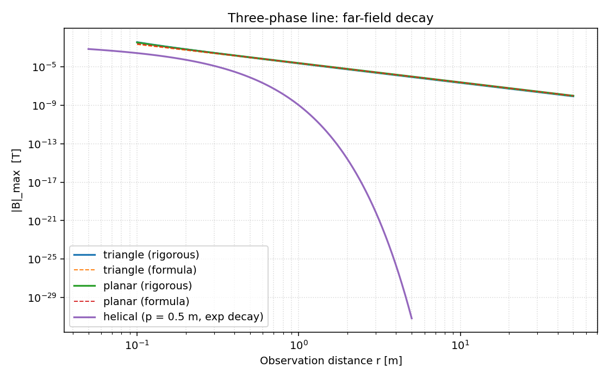

# Radia — Open-Space Electromagnetics, Python-Native

[](https://github.com/ksugahar/Radia/actions/workflows/build-test.yml)
[](https://github.com/ksugahar/Radia/actions/workflows/policy-lint.yml)
[](https://www.python.org/downloads/)
[](LICENSE)

**A Python-native electromagnetic source framework for [NGSolve](https://ngsolve.org/) and [ngsolve.bem](https://docu.ngsolve.org/latest/i-tutorials/unit-8.1-ngbem/ngbem.html).**

Radia provides **analytical field sources** ($B$, $H$, $A$, $\Phi$) as native C++ `CoefficientFunction` objects that NGSolve and ngsolve.bem consume directly during finite element assembly. Where FEM needs boundary conditions and source terms, Radia delivers them — analytically, without meshing the source region.

> **For:** magnetic levitation · wireless power transfer · induction heating · particle accelerators & undulators — any problem where the **field source** (coils, magnets, conductors) defines the performance and the surrounding space is mostly air.

## 🌟 What makes this unique

Three things in this repository do not, as far as we know, exist anywhere else:

1. **Analytic EM sources *inside* NGSolve's assembly loop.** `rad.RadiaField()` hands Radia's coils and magnets to NGSolve as a native C++ `CoefficientFunction`, evaluated by a GIL-free Fast Multipole Method *during* finite-element assembly — an **exact** source term, with no air mesh and no grid interpolation.
2. **Curved high-order *hex* meshes in NGSolve — [`cubit-mesh-export`](packages/cubit-mesh-export/).** Netgen gives NGSolve high-order curved *tetrahedra*; high-order **hexahedral** meshes have had no path in. This exports Coreform Cubit hex meshes to NGSolve `.vol` with ACIS geometry projection at **order 1–5** — the only route we know of to **high-order hex FEM in the NGSolve / Netgen ecosystem**. A curved hex sphere's NGSolve volume converges to the analytic value as the order rises — order 1 **−23 %** → order 2 **−0.2 %** → order 3 **+0.1 %** ([runnable demo](docs/cubit_mesh_export/hex_sphere_highorder/), no Cubit needed to reproduce).
3. **The first public MCP server suite for CAE meshing — [`radia-mcp`](packages/radia-mcp/).** The first and only [Model Context Protocol](https://modelcontextprotocol.io/) servers for Coreform Cubit, Gmsh, and build123d: an AI agent can generate real meshes, author CAD, and run FEM / BEM / PEEC *correctly* — not just describe them.
4. **Circuit-aware SPICE/LTspice tooling — [`radia-spice-lab`](packages/radia-spice-lab/).** The former standalone `spice-circuit-lab` repository now lives in this monorepo as Radia's public LTspice interoperability library: `.asc` / `.cir` / schemdraw conversion, topology-preserving round-trip checks, `.measure` log summaries, and a public MCP server for agentic circuit workflows. Private RAW-analysis and invention-learning pipelines stay outside the public repository.

## ✨ Why Radia?

**General-purpose FEM makes you mesh the air around your device. Radia doesn't.**

- 🌬️ **No air mesh** — open boundaries and large gaps are handled analytically; the condition at infinity is satisfied exactly, with no truncation boundary.
- 🧲 **Moving magnets are trivial** — translate or rotate a source with one `rad.Trsf`; no re-meshing, no sliding interfaces, no numerical noise.
- 📐 **Exact source geometry** — analytic arcs, race-track coils, Halbach arrays, and helical undulators, not coarse filament approximations.
- 🪞 **Surface-based skin effect** — SIBC + PEEC solve conductors *on the surface*, instead of a micron-scale volume mesh inside every wire.
- 🔗 **A source provider for FEM, not a replacement** — Radia fields plug into [NGSolve](https://ngsolve.org/) as native C++ `CoefficientFunction`s, so FEM does what it is best at (saturation, eddy currents, thermal coupling).
- 🐍 **Python-native & GUI-free** — geometry and physics are readable Python: scriptable, version-controllable, and ready for gradient-based or Bayesian optimization.
- 🤖 **LLM-agent-ready** — the companion [`radia-mcp`](#-ai-native-knowledge-the-radia-mcp-server-suite) servers let an AI assistant (Claude Code, Cursor, …) drive the Radia + NGSolve workflow *correctly*, not just plausibly.

## ⚡ Try Radia in 60 seconds

```bash
pip install radia          # Windows + Python 3.12 — C++ core + NGSolve + Intel MKL
```

```python
import radia as rad

# A 10 mm NdFeB cube, magnetized +z at 1.2 T — defined analytically, no mesh
magnet = rad.ObjRecMag([0, 0, 0], [10, 10, 10], [0, 0, 1.2])

# Evaluate B 20 mm above the magnet — exact, at any point in space
print(rad.Fld(magnet, 'b', [0, 0, 20]), "T")   # -> [0.0, 0.0, +Bz]  (on-axis Bx=By=0 by symmetry)
```

No mesh, no artificial boundary, no solver setup: the field is an **analytic object** you can evaluate anywhere, move with a transform, or hand to NGSolve as a source.
**Next:** [full install + GUI panels](#quick-start) · [method notebooks](docs/) · [AI-assisted workflows](#-ai-native-knowledge-the-radia-mcp-server-suite).

## 🖼️ Gallery

| Permanent-magnet field | Solenoid axial field | Three-phase line field |
|:--:|:--:|:--:|
|  |  |  |

Every plot above is reproduced by the self-contained notebook [`docs/analytical_formulas/analytical_formulas.ipynb`](docs/analytical_formulas/analytical_formulas.ipynb) and checked against a closed-form reference. More worked examples — Halbach arrays, eddy-current shielding, induction heating, accelerator magnets — live throughout [`docs/`](docs/).

## 👤 Who is this for?

- **MagLev / levitation researchers** — drag & lift on Halbach arrays over conductive tracks (EDS), differential-inductance matrices for EMS control loops, and high-precision force-vs-gap curves.
- **Wireless-power & induction-heating engineers** — surface-impedance (SIBC) skin/proximity modeling and PEEC circuit extraction (L, R, C, M) straight from conductor geometry, with SPICE-ready output.
- **Accelerator & undulator designers** — Radia's original use case at the ESRF: insertion devices, Halbach undulators, and beamline magnets with analytic field fidelity.
- **Anyone fighting "air mesh"** in a general-purpose FEM tool for an open-boundary or moving-source problem.

## 🧭 Repository Architecture & Policy

Radia is organized as a layered CAE stack, not as one monolithic solver. The repository policy is to use the strongest public ecosystem pieces where they already exist, and to implement only the missing electromagnetic and multiphysics layers.

| Layer | Radia policy |
|---|---|
| Differential geometry | Use the de Rham-complex design exposed by NGSolve where possible; keep Radia's collocation and integral-method formulations compatible with that language. |
| Analysis methods | Use NGSolve / ngsolve.bem for FEM and BEM. Implement Radia-specific HDiv-VIM magnetic-material, PEEC, and source-provider methods in Radia. |
| Linear algebra | Reuse proven solvers and compression ideas such as AMS, BDDC, shifted ICCG, BiCGSTAB, ACA / TSVD, and HACApK instead of inventing local replacements. |
| Physical methods | Focus development effort on the physics layer: ESIM / SIBC, reduced potentials, Kelvin transforms, CLN, stream functions, and open-region source models. |
| Applications | Keep application examples concrete: induction heating, MagLev, electromagnets, printed circuit boards, and motors. |
| Interfaces | Provide GUIs only for application-level workflows. Generic reusable capabilities should stay as Python APIs, notebooks, CLI tools, and MCP servers. |

The practical rules are simple: follow NGSolve's Python API style when extending finite-element workflows; use pybind11 for C++ functionality exposed to Python; avoid reinventing public ecosystem tools; and implement multiple independent methods for the same model whenever that enables cross-validation. The `radia-mcp` servers are part of this policy: they let agents drive the workflow, collect lessons from validation, and keep the repository's knowledge executable rather than only descriptive.

## 🚀 Mission: The Design Tool for Open-Space Magnetics

**Radia** is a specialized simulation framework developed as a **Design Tool** targeting:

*   **Magnetic Levitation (MagLev)**
*   **Wireless Power Transfer (WPT)**
*   **Induction Heating**
*   **Particle Accelerators & Beamlines**

Unlike general-purpose FEM tools optimized for motors (rotating machinery) with narrow gaps and sliding meshes, Radia addresses the unique challenges of **Open-Space Magnetics**:

*   **Large Air Gaps**: Solves open boundary problems exactly without meshing the air.
*   **Moving Permanent Magnets**: Dynamic simulation of moving magnets (levitation, undulators) is trivial and noise-free because there is no air mesh to distort or regenerate.
*   **Complex Source Geometries**: Models race-track coils, helical undulators, and Halbach arrays analytically with perfect geometric fidelity.
*   **System Level Simulation**: Designed for systems where the field source topology (coils/magnets) defines the performance.

**This is not just a solver; it is a Framework.** We provide the architecture to build specific solvers for your unique magnetic systems.

### Current Capabilities & Active Development

**Implemented**:
*   **PEEC Circuit Extraction**: C++ MNA solver with MKL LAPACK for L, R, C, M extraction from conductor geometry.
*   **Multi-filament Skin Effect**: `nwinc`/`nhinc` cross-section subdivision for skin/proximity effect modeling.
*   **FastHenry Compatibility**: Parse `.inp` files directly with one-step solve.
*   **Coupled PEEC + HDiv-VIM**: Conductor-core coupling via Biot-Savart + Radia HDiv-VIM soft-iron solve.
*   **ESIM (Effective Surface Impedance Method)**: Nonlinear surface impedance for induction heating analysis.
*   **Templated BiCGSTAB**: Shared real/complex Krylov infrastructure via `rad_bicgstab.h`.

**In Development**:
*   **HACApK for PEEC**: H-matrix acceleration for large PEEC systems (L matrix compression).
*   **Application Library**: Reference examples for MagLev, WPT, and Accelerator magnets.

---

## 💎 Strategic Value: Solving What FEM Cannot

**Closing the Gap in Computational Electromagnetics.**

Commercially available Finite Element Method (FEM) tools are powerful, but they face inherent limitations when dealing with open regions and moving parts. Radia provides a **Complementary Framework** based on **Integral Methods (Green's Functions / Kernels)** to solve these specific classes of problems effectively.

*   **The "Open Boundary" Problem**: FEM requires truncating the universe with artificial boundaries (or expensive infinite elements).
    *   *Our Solution*: Integral methods naturally satisfy the condition at infinity. No air mesh is needed.
*   **The "Moving Source" Problem**: Moving a coil or magnet in FEM requires complex re-meshing or sliding interfaces, introducing numerical noise.
    *   *Our Solution*: Sources are analytical objects. Moving them is a simple coordinate transformation, free of discretization error.

**We do not replace FEM; We are the Source Provider for FEM.**
Radia actively feeds NGSolve and ngsolve.bem with high-fidelity electromagnetic sources — coils, magnets, and conductor impedances — so that FEM can focus on what it does best: solving material-dominated PDEs (saturation, eddy currents, thermal coupling). The integration is not a loose coupling; Radia's fields are evaluated **inside** NGSolve's assembly loop as native `CoefficientFunction` objects.

---

## ⚡ Paradigm Shift: Surface-Based Physics

**Volume Meshing is Obsolete for Conductors.**

For high-frequency applications (WPT, Induction Heating, Accelerators), traditional FEM struggles with the **Multi-Scale Challenge**:
*   **Macro Scale**: Large air gaps (meters)
*   **Micro Scale**: Skin depth (microns)

Attempting to mesh both simultaneously results in massive element counts and slow convergence. **We reject this approach.**

**The Radia PEEC Solution: SIBC + MKL LAPACK**
We solve the physics exactly where it happens: **On the Surface.**

1.  **SIBC (Surface Impedance Boundary Condition)**: Mathematical modeling of skin effect physics directly on the boundary. No internal mesh is required inside the conductor.
2.  **PEEC + MKL LAPACK**: C++ MNA (Modified Nodal Analysis) solver with Intel MKL LAPACK (`zgesv_`, `zgetrf_`, `zgetrs_`) and templated BiCGSTAB for fast impedance extraction.
3.  **FastHenry Compatibility**: Parse `.inp` files directly, including multi-filament (`nwinc`/`nhinc`) for skin/proximity effect.

**Result**: Direct circuit parameter extraction (L, R, C, M) from conductor geometry, with SPICE-ready output.

## 🦁 Academic Heritage & Citations

Radia is not a new invention; it is the **Modern Evolution** of battle-tested scientific codes developed at world-leading research institutes.
We stand on the shoulders of giants:

*   **Radia (ESRF)**: Developed by **O. Chubar, P. Elleaume, et al.** at the European Synchrotron Radiation Facility. The standard for undulator design for decades.
    *   *Ref*: O. Chubar, P. Elleaume, J. Chavanne, "A 3D Magnetostatics Computer Code for Insertion Devices", J. Synchrotron Rad. (1998).
*   **FastImp (MIT)**: Developed by **J. White, et al.** at MIT. The pioneer of pFFT-accelerated Surface Integral Equation methods.
    *   *Ref*: Z. Zhu, B. Song, J. White, "Algorithms in FastImp: A Fast and Wide-Band Impedance Extraction Program", DAC (2003).
*   **[HACApK](https://github.com/RIKENGITHUB/ppOpen-HPC) (JAMSTEC/RIKEN)**: Developed by **A. Ida, et al.** at JAMSTEC. Hierarchical matrices with Adaptive Cross Approximation for Krylov solvers.
    *   *Ref*: A. Ida, T. Iwashita, T. Mifune, Y. Takahashi, "Parallel Hierarchical Matrices with Adaptive Cross Approximation on Symmetric Multiprocessing Clusters", J. Inf. Process., Vol. 22, No. 4, pp. 642–650 (2014).

---

## 📐 Mathematical Foundations: The Power of Analytical Kernels

The core advantage of **Integral Element Method (IEM)** is the use of **Analytical Integration** over source volumes and surfaces, eliminating discretization error.

### 1. Analytical Sources (Radia Kernels)
Instead of approximating a coil as a bundle of sticks, we analytically integrate the Bio-Savart law:

$$ \vec{B}(\vec{r}) = \frac{\mu_0 I}{4\pi} \int_{Volume} \vec{J}(\vec{r}') \times \frac{\vec{r} - \vec{r}'}{|\vec{r} - \vec{r}'|^3} dV' $$

For specific geometries, this yields **Exact Closed-Form Solutions**:
*   **Polygonal Coils**: Exact integration of straight segments.
*   **Arc Segments**: Exact integration of circular arcs.
*   **Cylindrical Magnets**: Exact field formulas involving elliptic integrals.
*   **Polyhedral Magnets**: Exact surface charge integration ($\sigma_m = \vec{M} \cdot \vec{n}$).

### 2. HDiv-VIM Soft-Iron Demagnetization
For soft iron and saturation, Radia uses **HDiv-VIM** on NGSolve-compatible meshes. The magnetization $\vec{M}$ inside a volume $\Omega$ induces the open-boundary scalar-potential contribution:

$$ \phi_m(\vec{r}) = \frac{1}{4\pi} \oint_{\partial \Omega} \frac{\vec{M} \cdot \vec{n}'}{|\vec{r} - \vec{r}'|} dS' - \frac{1}{4\pi} \int_{\Omega} \frac{\nabla' \cdot \vec{M}}{|\vec{r} - \vec{r}'|} dV' $$

### 3. Surface Impedance & FastImp Kernels (MQS/Darwin Regime)
For conductor analysis, we solve the Surface Integral Equation (SIE) using the **Laplace kernel**:

$$ G(\vec{r}, \vec{r}') = \frac{1}{4\pi|\vec{r} - \vec{r}'|} $$

**Supported Frequency Regime**: Magneto-Quasi-Static (MQS) to Darwin approximation.
- **MQS**: Ignores displacement current ($\partial D/\partial t \approx 0$). Valid when $\lambda >> L$ (wavelength >> problem size).
- **Darwin**: Includes inductive effects but ignores radiation. Valid for $kL << 1$ where $k = \omega/c$.

Combined with **SIBC (Surface Impedance Boundary Condition)**, this reduces the volumetric skin-effect problem to a purely surface-based boundary element problem.

> [!NOTE]
> **Full-wave Helmholtz kernel** ($e^{ikr}/r$) has been removed. Radia targets MQS/Darwin applications (MagLev, WPT, Induction Heating) where wavelength >> device size, making the quasi-static approximation highly accurate and computationally efficient.

---

## 🧘 Philosophy: The Source Provider for NGSolve

**Radia exists to give NGSolve and ngsolve.bem the best possible electromagnetic sources.**

The division of labor is clear:

| Role | Engine | What it computes |
| :--- | :--- | :--- |
| **Source Provider** | **Radia** | $H_s$, $B_s$, $A_s$, $\Phi_s$ from coils, magnets, conductors — analytically |
| **Material Solver** | **NGSolve** | Reaction fields in iron/dielectric via FEM ($\nabla \cdot \mu \nabla \phi = -\nabla \cdot \mu H_s$) |
| **Eddy Current Solver** | **ngsolve.bem** | Surface eddy currents via BEM (HDivSurface $\times$ SurfaceL2) |
| **Circuit Extraction** | **Radia PEEC** | Impedance (L, R, C, M) from conductor geometry for SPICE |

**How the integration works**:
1.  Radia computes the source field analytically (no mesh, no discretization error).
2.  `rad.RadiaField()` wraps the result as an NGSolve `CoefficientFunction` — a native C++ object evaluated directly inside NGSolve's element assembly loop. Since v2.5.0, `RadiaField` is integrated into the main `_radia_pybind.pyd` module; no separate `radia_ngsolve` module is needed.
3.  NGSolve / ngsolve.bem solve the reaction problem driven by this source.
4.  Result = Source Field (Radia) + Reaction Field (NGSolve).

We bridge the gap between distinct mathematical communities:
*   **Integral Codes**: Radia (ESRF) & FastImp (MIT) $\rightarrow$ *Analytical source fields.*
*   **Finite Element Codes**: NGSolve (TU Wien) & ngsolve.bem $\rightarrow$ *Material & eddy current solvers.*

---

## 🤖 LLM-Agent Ready & Python Native

**"No GUI? No Problem."**

We believe that **Natural Language is the ultimate User Interface** for complex design.
Instead of clicking through nested menus to find a "Halbach Array" button, you simply describe what you want.

*   **Code-First Modeling**: Geometry and physics are defined in pure, human-readable Python.
*   **The "Nanobanana" Vision**: By combining Radia with modern AI, we turn text prompts into rigorous engineering models.
    *   *Prompt*: "Create a Halbach array for a MagLev slider with 12 periods, optimized for 5mm levitation gap."
    *   *Result*: An Agent generates the complete executable Radia script, including geometric parameters and material definitions.

> [!TIP]
> **Why Python?** GUI-based tools are excellent for standard tasks, but they limit you to what the developer imagined. Python + Radia limits you only by Python's endless ecosystem.

*   **Ecosystem Integration**: Seamlessly integrates with the rich Python scientific stack (NumPy, SciPy, PyVista, NGSolve) and modern version control (Git).

---

## 🧠 AI-Native Knowledge: the `radia-mcp` Server Suite

**The hard part of FEM/BEM is not the API — it is knowing _which_ formulation, preconditioner, or closed-form check to use.** The companion package [`radia-mcp`](packages/radia-mcp/) — **the first and only public MCP server suite for Coreform Cubit, Gmsh, and build123d** — packages that expertise as **40+ Model Context Protocol (MCP) servers (340+ tools)**, so an AI assistant (Claude Code, Cursor, Continue, …) drives the Radia + NGSolve workflow *correctly* — not just plausibly.

```bash
pip install radia-mcp
```

### `radia-ngsolve` — the NGSolve FEM/BEM brain (34 tools)

The flagship server for this repository turns the Radia ↔ NGSolve hybrid (FEM + BEM + PEEC) from tribal knowledge into queryable, version-controlled, **offline** documentation **plus live diagnostic tools**:

| Theme | Representative tools | What you get |
| :--- | :--- | :--- |
| **Validation oracle** | `analytical_formulas` | _"Given analysis X, which closed form is the trusted reference?"_ — Wakao-Igarashi-Fujiwara-Kameari Part 1–9, cuboid average-$B$ (sympy-derived C++ kernel), full Bessel cylindrical AC impedance, ellipsoid demagnetization, thin-plate eddy current, … |
| **Open boundary** | `kelvin_transformation`, `kelvin_identify_post_hoc` | Kelvin-inversion theory for exact open-boundary FEM — **plus a live tool** that patches Kelvin Periodic Identifications into an existing `.vol` |
| **HCurl preconditioning** | `sparsesolv` | Compact AMS / Hiptmair-Xu (HYPRE-free, TaskManager-native) for curl-curl eddy-current systems |
| **Model-order reduction** | `cln_3d`, `cln_sibc_orthogonal`, `cln_sphere_dd_pipeline`, `bem_cln` | Cauer Ladder Network MOR, incl. a double-double (~32-digit) VIM pipeline |
| **Circuit extraction** | `peec_inductance`, `ngsbem_inductance` | PEEC-from-STEP and `ngsolve.bem` inductance recipes |
| **Surface impedance** | `esim` | ESIM nonlinear cell problem for induction-heating workpieces |
| **Axisymmetric FE** | `axifem_documentation` | Henrotte $Q$-element axisymmetric basis for 2D axisymmetric magnetics |
| **Force & cross-validation** | `force_validation` | EM force extraction (Maxwell stress / virtual work) with closed-form cross-checks |
| **Parallelism** | `taskmanager` | The caller-wraps TaskManager policy + repo audit |
| **Live linting** | `lint_radia_script`, `lint_radia_directory` | Flags NGSolve/Radia convention violations before they ship |
| **Panel development** | `panel_schema`, `panel_add_param`, `panel_widget_locations` | Introspect and extend notebook panel workbenches |

### Self-describing — start at `radia-meta`

The suite is a catalog: call **`mcp-server-radia-meta`** first and it tells you which of the 40+ servers covers your concept — NGSolve, Cubit hex meshing, build123d CAD authoring, Gmsh post-processing, differential-forms + Mathematica symbolic verification, PEEC, motors, MOR, optimization (Optuna / Bayesian / evolutionary), TEAM benchmarks, and more.

```python
radia_mcp_overview()            # every server + tag
radia_mcp_by_tag("ngsolve")     # which servers cover NGSolve?
radia_ngsolve_status()          # live tool list + dependency probe
```

See [`packages/radia-mcp/README.md`](packages/radia-mcp/README.md) for the full catalog and MCP client config snippets.

---

## 💡 Architecture: Source (IEM) + Material (FEM) + Eddy Current (BEM)

We define our unique approach as a hybrid of **Integral Element Method (IEM)**, **Finite Element Method (FEM)**, and **Boundary Element Method (BEM)**.

**What is "Integral Element Method (IEM)"?**
Unlike FEM, which uses uniform element formulations, IEM allows the combination of elements with **different integration kernels** (e.g., $1/r$ for monopoles, $\vec{J} \times \vec{r}/r^3$ for Biot-Savart) into a single system. All kernels use the **Laplace form** ($1/r$) for quasi-static analysis.

| Layer | Method | Role & Kernels | Advantage |
| :--- | :--- | :--- | :--- |
| **Source Layer** | **IEM** (Radia) | **Laplace Kernels** ($1/r$): Volume Magnets, Coils, SIBC Surfaces. Provides $H_s$, $B_s$, $A_s$ as `CoefficientFunction`. | **Composable & Analytical.** No mesh needed for sources. |
| **Material Layer** | **FEM** (NGSolve) | **Differential Operators** ($\nabla \cdot \mu \nabla$): Saturation, Hysteresis, Thermal. | **Non-Linear & Multi-Physics.** |
| **Eddy Current Layer** | **BEM** (ngsolve.bem) | **Surface BEM** (HDivSurface $\times$ SurfaceL2): Eddy currents, shielding. | **No volume mesh in conductors.** |

**The Workflow:**
1.  **Radia**: Computes the source field ($H_s$ or $T_s$) analytically.
2.  **NGSolve**: Solves for the reaction potential ($\phi$) in the iron regions using FEM.
    *   $\nabla \cdot (\mu \nabla \phi) = -\nabla \cdot (\mu H_s)$
    *   **Frequency Range**: Primarily targets **Low Frequency** (Magnetostatics / Eddy Currents), shielding, and extending up to the **Darwin Regime** (ignoring radiation, but including displacement currents if needed).
3.  **Result**: Superposition of Source Field + Reaction Field.

> [!NOTE]
> **Design**: The coupling is intentionally one-way (Radia Sources $\rightarrow$ NGSolve/ngsolve.bem). Radia provides the source; NGSolve and ngsolve.bem solve the reaction. This clean separation keeps the architecture composable and each solver optimal for its role.

### NGSolve Integration Details (Weak Coupling Mechanism)
The `rad.RadiaField()` function (integrated into `_radia_pybind.pyd` since v2.5.0) implements a high-performance **Weak Coupling** bridge using a native C++ `CoefficientFunction`. This allows Radia fields to be evaluated directly during NGSolve's finite element assembly process.

**Implementation Architecture:**
*   **Native C++ Shim**: A `RadiaFieldCF` class (inheriting from `ngfem::CoefficientFunction`) sits between NGSolve and Radia.
*   **Three-Tier Evaluation Strategy**:
    1.  **Fast FMM (C++)**: For `B`, `H`, and `A` fields, dipoles are extracted from Radia and evaluated using a C++ Fast Multipole Method (FMM) solver. This **bypasses the Python Global Interpreter Lock (GIL)** entirely, enabling maximum performance during massive parallel FEM assembly.
    2.  **Cached Evaluation**: A coordinate-hash cache prevents redundant re-calculation of fields at the same integration points.
    3.  **Python Fallback**: For complex material responses (Magnetization `M`, Scalar Potential `Phi`), it safely acquires the GIL and calls the Radia Python kernel.

### NGSolve Primer for Radia Users
*   **CoefficientFunction (CF)**: A generic function that can be evaluated anywhere in the 3D domain. Radia provides the source Magnetic Field ($H_s$) as a C++ `CoefficientFunction`. This means NGSolve can "query" Radia for the field value at any coordinate during matrix assembly **without needing to store values on a mesh** or interpolate from a grid.
*   **GridFunction (GF)**: A field defined on the finite element mesh (stored as vectors of coefficients). This typically represents the *solution* (like the Magnetic Potential $\phi$) or the *material property distribution* (like Permeability $\mu$) in the FEM model.

---

## Key Capabilities

### 1. Integrated Field Sources
Instead of simple "boundary conditions", Radia provides rich physical sources:

*   **Permanent Magnets**: Analytical surface charge method (Polyhedrons, Extrusions).
*   **Moving Magnets & Coils**: Sources can have arbitrary position and orientation transformations applied dynamically.
    *   *Development Status*: Comprehensive dynamic simulation examples and animation workflows are currently being developed.
*   **Coils & Current Loops**: Biot-Savart integration for arbitrary paths.
*   **Distributed Currents**: Arc segments, race-tracks, and helical filaments.
*   **Analytical Precision**: To eliminate source errors, **fully analytical formulas** are used wherever possible (e.g., exact integration for straight/arc segments, analytical surface charges) rather than approximate numerical integration.
*   **Versatile Field Types**: Supports computation of **A** (Vector Potential), **Phi** (Scalar Potential), **B** (Flux Density), and **H** (Field Intensity) to drive various FEM formulations ($A$-formulation, Reduced-Scalar-Potential, etc.).


### 2. High-Performance Solvers & Acceleration
To handle complex field sources efficiently, the framework employs state-of-the-art acceleration algorithms based on the **Laplace kernel** ($1/r$):

*   **Solver Acceleration (Source Definition)**:
    *   **$\mathcal{H}$-Matrix ([HACApK](https://github.com/RIKENGITHUB/ppOpen-HPC) ACA+)**: Used by HDiv-VIM charge-Gram, BEM, and PEEC matrix paths. Compresses dense Laplace-kernel interactions to $O(N \log N)$ where repeated matvecs dominate.
    *   **PEEC + MKL LAPACK**: C++ PEEC solver with Intel MKL LAPACK/BLAS for circuit parameter extraction. SIBC models skin depth effects as surface properties, with reusable real/complex Krylov support.
*   **Field Evaluation Acceleration**:
    *   **FMM (ExaFMM-t)**: Fast Multipole Method using Laplace kernel for rapidly computing fields ($B, H, A$) from massive numbers of source elements. This is critical for the `CoefficientFunction` interface to NGSolve.
*   **Hybrid FEM**: Reduced Potential coupling with NGSolve.

> [!NOTE]
> **All acceleration methods use Laplace kernel** ($1/r$). This ensures consistency across the framework and optimal performance for MQS/Darwin applications.


### 3. Visualization & Export
*   **PyVista Viewer**: Modern, interactive 3D visualization within Python/Jupyter.
*   **VTK Export**: Compatible with ParaView.
*   **GMSH/STEP**: Mesh import via GMSH, CAD interoperability via Coreform Cubit (integrated radia Cubit plugin and `cubit_mesh_curver` module).

---

### 4. MagLev Specific Capabilities
We provide built-in formulations for the unique physics of magnetic levitation:

*   **EDS (Electrodynamic Suspension)**:
    *   **Drag & Lift Forces**: Accurate computation of velocity-dependent forces on moving magnets over conductive plates (using `rad.ObjMpl` or FastImp).
    *   **Inductrack**: Simulation of Halbach arrays moving over passive coils or litz-wire tracks.
*   **EMS (Electromagnetic Suspension)**:
    *   **Control Inductances**: Fast extraction of differential inductance matrices ($L_{ij}$) for control loop design (differentiate Flux $\Phi$ w.r.t current $I$).
    *   **Force-Gap Characteristics**: High-precision force vs. air-gap curves for nonlinear controller tuning.

## ⚖️ Workflow Comparison: Why Switch?

| Feature | Traditional FEM (Commercial) | **Radia Framework (IEM + FEM)** |
| :--- | :--- | :--- |
| **Air Mesh** | **Required.** Must mesh the "nothingness" around the device. | **None.** Air is handled analytically. |
| **Moving Parts** | **Hard.** Mesh deformation, sliding interfaces, re-meshing noise. | **Trivial.** Just apply a coordinate transform `rad.Trsf`. |
| **Coil Geometry** | **Approximated.** Step-files or coarse filaments. | **Exact.** Analytical arcs, straight segments, and volumes. |
| **Skin Effect** | **Heavy.** Requires dense volume mesh inside conductors. | **Light.** SIBC solves it on the surface only. |
| **Optimization** | **Blackbox.** Slow parameters sweeps via GUI. | **Transparent.** Fast, gradient-friendly Python execution. |

---

## Quick Start

### Prerequisites

| Requirement | Version | Notes |
|-------------|---------|-------|
| **OS** | **Windows 10 / 11 / Server 2022** | Windows-only (MSVC + MKL build). Linux/macOS not supported. |
| **Python** | **3.12** | exact (the C++ extension is built for `cp312-win_amd64`) |
| **Coreform Cubit** | **2025.12** | optional — only if you want the Cubit plugin / toolbar |
| **NGSolve** | **6.2.2604** | auto-installed from PyPI (curvedelements + Periodic BC fix) |
| **Intel MKL** | auto via `mkl>=2024.2.0` | auto-installed from PyPI (BLAS/LAPACK + Intel OpenMP) |

### Production install (recommended)

```bash
pip install --no-cache-dir 'radia[cubit]==4.90.2' \
    'radia-mcp==1.0.1' 'cubit-mesh-export==0.11.0'
cubit-plugin-install --all-users      # Deploy Cubit plugin (skip if no Cubit)
cubit-plugin-install --verify-only    # Confirm SHA-256 of every deployed binary
```

The 3 PyPI packages above are the **full lab-standard install**:

| Package | What it ships | Required? |
|---------|--------------|-----------|
| `radia[cubit]` | C++ core + NGSolve integration + notebook workbenches + Cubit plugin binaries | Yes |
| `radia-mcp` | 40+ MCP knowledge servers (340+ tools) led by `radia-ngsolve` (NGSolve FEM/BEM) for Claude / IDE integration | Optional (only for AI-assisted workflows) |
| `cubit-mesh-export` | High-order curved mesh export Cubit -> NGSolve `.vol` | Bundled by `radia[cubit]`; pin separately for explicit version control |
| `radia-spice-lab` | Public SPICE/LTspice interoperability library: `.asc` / `.cir` / schemdraw conversion, topology checks, `.measure` log summaries, and public MCP circuit tools | Bundled by `radia[spice]` / `radia[ltspice]` once the sibling package is published; install from `packages/radia-spice-lab` in-tree |

**Production deploy uses `[cubit]`, not `[gui]`**:
- `[cubit]` brings in `cubit-mesh-export` (curved mesh export + `cubit-plugin-install` CLI)
- `[spice]` / `[ltspice]` brings in `radia-spice-lab` (SPICE/LTspice conversion + circuit MCP tools)
- notebook workbenches are the canonical panel surface and do not require PySide6 in normal Radia Python
- Radia's old standalone desktop adapters are retired; the Cubit mesh-export toolbar remains a Cubit-embedded surface using Coreform's private runtime

**Pinning versions** (e.g. `==4.90.2`) is recommended for production / lab deploys so all team machines run an identical, audited combination.  Drop the `==` to track latest.

### Minimal install (Python API only, no panels)

If you only need the Python API + headless solvers (no Cubit plugin):

```bash
pip install radia                # C++ core + NGSolve + MKL only
```

This is the smallest footprint, but you lose the Cubit launcher.  Useful for headless servers, CI, or scripted batch runs.

### Notebook Panels

The canonical user-facing panels are Jupyter notebook workbenches.  They use the same headless `calc_*.py` scripts as the Cubit workflow and save durable `run.log` / `result.json` artifacts:

```bash
python -m jupyter lab src/radia/panels/notebooks/radia_ih.ipynb
python -m jupyter lab src/radia/panels/notebooks/radia_em.ipynb
python -m jupyter lab src/radia/panels/notebooks/radia_pcb.ipynb
python -m jupyter lab src/radia/panels/notebooks/radia_streamfunction.ipynb
```

The old PySide desktop adapters have been removed.  Use notebooks plus the headless `calc_*.py` scripts for analysis.  Cubit remains the mesh/export producer through the APREPRO plugin and the Cubit-embedded Export Mesh toolbar.

### MCP servers (`radia-mcp`)

If you use Claude Code or another MCP-aware IDE, `pip install radia-mcp` registers **40+ MCP servers (340+ tools)** — led by **`radia-ngsolve`** (the NGSolve FEM/BEM brain, 34 tools) plus `cubit`, `gmsh`, `build123d`, `peec`, `electromagnet`, `ih`, and more — giving the LLM read-only access to FEM/BEM/PEEC knowledge bases and live diagnostic tools (e.g. `analytical_formulas(...)` returns the trusted closed-form solution to validate a result against; `kelvin_identify_post_hoc(...)` patches Kelvin BCs into a `.vol`).  Start with `mcp-server-radia-meta`, which catalogs every server.  See the **🧠 AI-Native Knowledge** section above and [`packages/radia-mcp/README.md`](packages/radia-mcp/README.md) for details and client config.

### Updating

To upgrade an existing install, repeat the production-install command with the new version pin (or drop the pin to track latest):

```bash
# Stop any Python / Cubit subprocesses holding .pyd locks:
# (Windows) Get-Process python,coreform_cubit -EA SilentlyContinue |
#           Stop-Process -Force

pip install --upgrade --no-cache-dir 'radia[cubit]==<new>' \
    'radia-mcp==<new>' 'cubit-mesh-export==<new>'
cubit-plugin-install --all-users
cubit-plugin-install --verify-only
```

The `Stop-Process` step is required if Cubit / Python / MCP server subprocesses are running — otherwise pip may refuse to replace locked files.  See **Troubleshooting** below.

### Multi-user lab deploy (`--all-users`)

For shared Windows boxes (lab seats, multi-user workstations), install once as Administrator and use `--all-users` to register the Cubit plugin for every existing local profile:

```powershell
# As Administrator
pip install --upgrade --no-cache-dir 'radia[cubit]==4.90.2' \
    'radia-mcp==1.0.1' 'cubit-mesh-export==0.11.0'
cubit-plugin-install --all-users      # Updates every C:\Users\*\.cubit profile
cubit-plugin-install --verify-only    # Confirms SHA-256 across all destinations
```

Each user's Cubit license cache (`%LOCALAPPDATA%\Coreform\Cubit\...\renewals`) is managed by Cubit itself — admin must **NOT** copy `.lic` files between users (creates broken-owner files that block RLM checkout for non-admin accounts).

### Verify installation

After install, confirm everything is wired correctly:

```bash
# 1. Versions match (PyPI pin)
python -c "import radia, radia_mcp, cubit_mesh_export; \
           print(f'radia={radia.__version__} radia_mcp={radia_mcp.__version__} \
cubit_mesh_export={cubit_mesh_export.__version__}')"
# Expected: radia=4.90.2 radia_mcp=1.0.1 cubit_mesh_export=0.11.0

# 2. Cubit plugin binaries SHA-verified
cubit-plugin-install --verify-only
# Expected: [OK] every expected binary present and matches package source.
#           compat: radia 4.90.2 <-> cubit-mesh-export 0.11.0 compatible
```

### Troubleshooting

| Symptom | Cause | Fix |
|---------|-------|-----|
| `ERROR: Could not install packages due to an OSError: [WinError 32] ... .pyd` | Python / Cubit subprocess still holds the binary locked | `Stop-Process -Name python,coreform_cubit -Force` then retry pip install |
| Old `radia-ih` / `radia-em` executable is missing | PySide desktop adapters were retired | use the canonical notebook workbench; do not add PySide6 to production normal Python |
| `ERROR: No matching distribution found for radia==X.Y.Z` immediately after release | PyPI index mirror lag (usually < 5 min) | wait 5 min, retry; or check [pypi.org/project/radia](https://pypi.org/project/radia/) for actual availability |
| Cubit panel shows old behaviour after upgrade | Cubit was running during install; plugin DLL was replaced but Cubit is still loading the previous version | restart Cubit |
| `cubit-plugin-install` reports "Preflight refused to proceed" | locked `.pyd` / `.ccm` in Cubit/bin | release locks (Stop-Process above), retry |
| `compat:` line shows a version mismatch | partial install (one of the 3 packages didn't upgrade) | re-run the full `pip install` command with all 3 packages explicit |

### Example 1: Magnetostatic Source Field

```python
import radia as rad

# Define a Race-Track Coil
coil = rad.ObjRaceTrk(
    [0,0,0],       # Center
    [10, 30],      # Inner Radii (R_min, R_max)
    [20, 100],     # Straight section lengths (Lx, Ly)
    10.0,          # Height
    3.0,           # Curvature radius
    1000.0,        # Current [A]
    'man'          # Manually defined rectangular cross-section
)

# Evaluate B on-axis, 50 mm above the coil centre — analytic, no mesh
B = rad.Fld(coil, 'b', [0, 0, 50])
print(f"B = {B} T")
```

### Example 2: PEEC Circuit Parameter Extraction

```python
from radia.peec_matrices import PyPEECBuilder
from radia.peec_topology import PEECCircuitSolver
import numpy as np

# Build a simple inductor: 4 segments in series
builder = PyPEECBuilder()
n1 = builder.add_node_at(0, 0, 0)
n2 = builder.add_node_at(0.05, 0, 0)
n3 = builder.add_node_at(0.05, 0.05, 0)
n4 = builder.add_node_at(0, 0.05, 0)
for na, nb in [(n1,n2), (n2,n3), (n3,n4), (n4,n1)]:
    builder.add_connected_segment(na, nb, w=1e-3, h=1e-3, sigma=5.8e7, nwinc=3, nhinc=3)
builder.add_port(n1, n1)  # Single-turn loop

topo = builder.build_topology()
solver = PEECCircuitSolver(topo)

# Extract impedance vs frequency
freqs = np.logspace(2, 6, 20)
Z = solver.frequency_sweep(freqs)
R = np.real(Z)
L = np.imag(Z) / (2 * np.pi * freqs)
print(f"DC: R={R[0]*1e3:.2f} mOhm, L={L[0]*1e9:.1f} nH")
```

### Example 3: FastHenry .inp Import

```python
from radia.fasthenry_parser import FastHenryParser

parser = FastHenryParser()
parser.parse_string("""
.Units mm
N1 x=0 y=0 z=0
N2 x=100 y=0 z=0
E1 N1 N2 w=1 h=1 sigma=5.8e7 nwinc=5 nhinc=5
.external N1 N2
.freq fmin=100 fmax=1e6 ndec=5
.end
""")
result = parser.solve()
print(f"DC: R={result['R'][0]*1e3:.3f} mOhm, L={result['L'][0]*1e9:.1f} nH")
```

---

## Documentation & Resources

*   **[Installation Guide](BUILD.md)**: Build from source (Windows/Linux/macOS).
*   **[API Reference](docs/api/API_REFERENCE.md)**: Full Python API documentation.
*   **[NGSolve Integration](docs/NGSOLVE_INTEGRATION.md)**: Theory and usage of the hybrid FEM-Integral method.
*   **[ngsolve.bem Integration](docs/solver/NGBEM_INTEGRATION_DESIGN.md)**: Eddy current solver via ngsolve.bem.
*   **[Original Radia](https://github.com/ochubar/Radia)**: The core physics engine developed at ESRF.

---

## Cubit Mesh Export

Radia includes a Cubit plugin for [Coreform Cubit](https://coreform.com/products/coreform-cubit/) that exports **curved high-order (order 1–5) meshes** — including the **hexahedral** meshes NGSolve otherwise cannot consume at high order — plus APREPRO commands for mesh export and coil generation.

### APREPRO Commands

```bash
# In Cubit command line or .jou files:
export netgen "mesh.vol" order 3 overwrite      # Netgen .vol (order 1-5)
export gmsh "mesh.msh" order 2 overwrite        # GMSH v4.1 (order 1-3)
export nastran_bdf "mesh.bdf" order 2 overwrite      # Nastran BDF (order 1-2)
export vtk "mesh.vtk" order 2 overwrite         # VTK Legacy (order 1-2)
coil "my_coil.py"                                   # CoilBuilder STEP + import
```

> **Note**: Use `export nastran_bdf`, not `export nastran` (avoids the Cubit built-in conflict).

### Python API

```python
from cubit_mesh_export import extract_curved_mesh
ng_mesh = extract_curved_mesh(cubit, order=3)  # High-order curved mesh
```

### Installation

See **[Quick Start > Production install](#production-install-recommended)** above for the full lab-standard install + verify + troubleshooting.  Minimal Cubit-side command summary:

```bash
pip install 'radia[cubit]'              # Includes plugin binaries
cubit-plugin-install --all-users        # Deploy to Cubit (.ccm backend + PySide6 toolbar)
cubit-plugin-install --verify-only      # SHA-256 confirm every deployed binary
```

### GUI Menus

| Menu | Items | Provided by |
|------|-------|-------------|
| **Export Mesh** | Netgen Vol, GMSH, Nastran, VTK | Cubit `.ccm` commands + PySide6 toolbar |
| **Solve** | Open notebook workbenches, Generate Coil, Reload Toolbar | Cubit Python |

Mesh Evaluation is maintained as a docs/notebook workflow, not as an Export
Mesh toolbar item.

**Important**: When using both NGSolve and Cubit in the same script, import NGSolve **before** Cubit to avoid DLL conflicts.

### Documentation

- **[Function Reference](docs/cubit/Function_Reference.md)** -- Full API and command reference
- **[Examples](docs/cubit_mesh_export/)** -- Export examples for all supported formats

## License

Radia contains multiple components with different license terms. See [LICENSE](LICENSE) for the full terms.

*   **Radia Core**: BSD-style (ESRF)
*   **$\mathcal{H}$-Matrix Library ([HACApK](https://github.com/RIKENGITHUB/ppOpen-HPC))**: MIT (ppOpen-HPC/JAMSTEC)
*   **sparseSolv integration**: Mozilla Public License 2.0

---
*Radia: Empowering the next generation of magnetic system design.*
