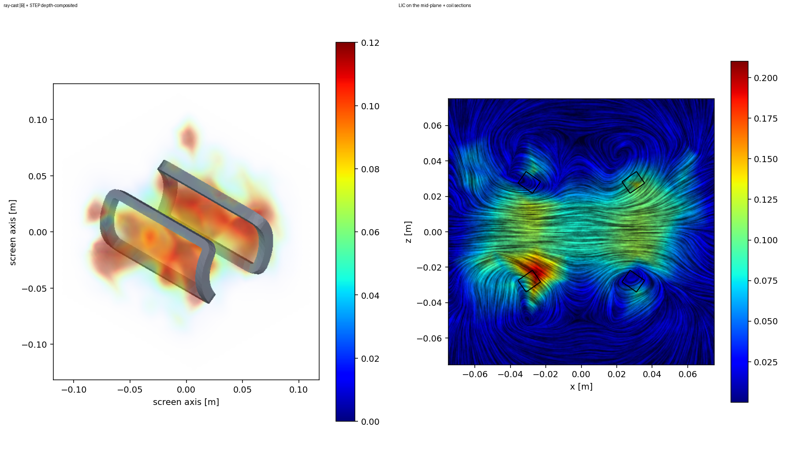
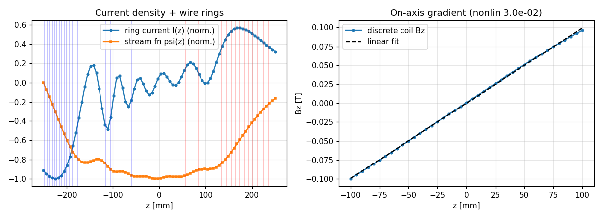
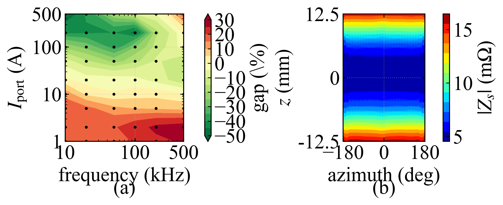
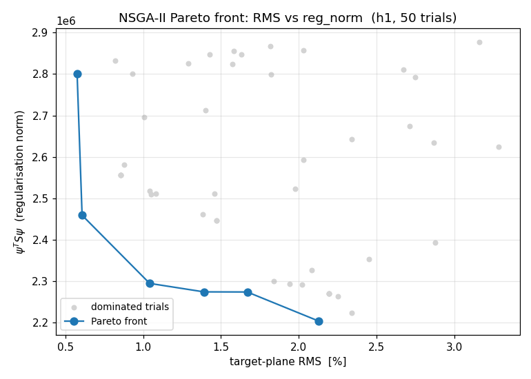
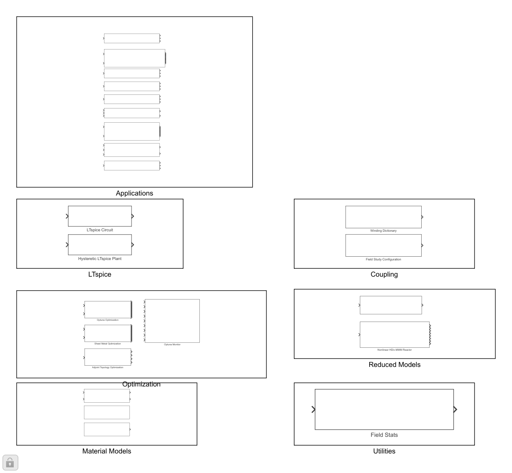
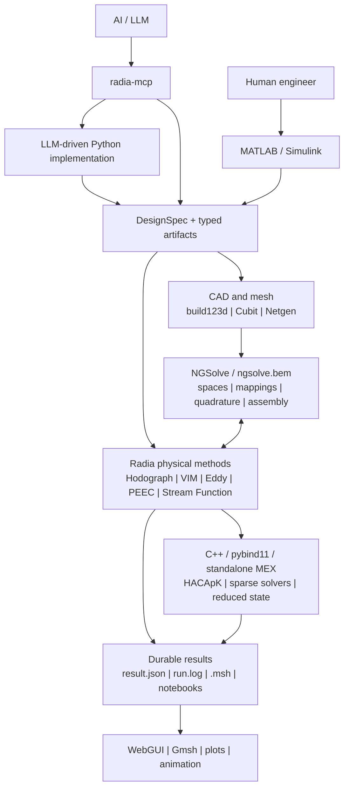

# Radia

<p align="center">
  <strong>From a target magnetic field to a coil you can inspect.</strong><br>
  Explore electromagnetic designs with an AI agent, examine the solved fields,
  and compose applications in Simulink.
</p>

<p align="center">
  <a href="https://github.com/ksugahar/Radia/actions/workflows/build-test.yml"></a>
  <a href="https://github.com/ksugahar/Radia/actions/workflows/radia-mcp-matrix.yml"></a>
  <a href="https://pypi.org/project/radia/"></a>
  <a href="https://pypi.org/project/radia-mcp/"></a>
  <a href="https://github.com/ksugahar/Radia/releases"></a>
  <a href="LICENSE"></a>
  <a href="https://github.com/ksugahar/Radia/stargazers"></a>
</p>

<p align="center">
  <a href="docs/gmsh_post/em_post_gallery.ipynb"></a>
</p>

*Saddle-coil field visualization: field magnitude over CAD and field direction
on a slice. Open the [executed field gallery](docs/gmsh_post/em_post_gallery.ipynb)
for the model, calculation, and comparison—not just the picture.*

Radia brings together **coil and magnet design, induction heating, curved HEX
meshes, and optimization** on [NGSolve](https://ngsolve.org/).
NGSolve owns the finite-element mathematics; Radia adds electromagnetic
methods, open-boundary operators, and engineering workflows.

**MCP is the front door and the canonical manual.** An LLM drives the Python
implementations through Radia MCP. **Simulink is the formal human-facing UI.**
These pages show what is possible; the MCP tools supply the current operating
instructions.

[See the results](#what-can-you-build) · [Simulink](#simulink) ·
[Start with MCP](#quick-start) · [Technical methods](#capabilities) ·
[Documentation](#documentation)

## What can you build?

### Design a coil for the field you need

Start from a target field, solve for a current distribution, and inspect the
winding contours and the field they produce.

[](docs/stream_function/theory.ipynb)

*An axial-gradient coil example: current distribution and winding locations
at left, discrete-coil field against a linear fit at right. This is a design
calculation, not a measured prototype.*

Explore the [stream-function method notebook](docs/stream_function/theory.ipynb)
and [complex-coil geometry and field notebook](docs/complex_coil_geometry/complex_coil.ipynb).
The latter includes saved CAD, sampling-mesh, field-magnitude, and vector views.

### See where induction-heating models differ

Use ESIM surface-impedance models to examine how excitation and local
surface response affect workpiece heating.

[](docs/ih_esim_benchmark/esim_showcase.ipynb)

*Historical benchmark: the workpiece-power difference between per-element and
uniform impedance models (left), and spatial impedance magnitude (right).
The difference is between two modeling routes, not an error against experiment.*

Open the [spatial ESIM demo](docs/ih_esim_benchmark/esim_spatial_demo.ipynb)
to rotate the coil and workpiece, inspect the mesh, and compare surface fields
and heating at three frequencies. The
[method and benchmark notebook](docs/ih_esim_benchmark/esim_showcase.ipynb)
explains the equations and checks. The spatial demo does **not** claim a
resolved-volume thermal solution; its normalized heat-transfer artifact is
distinguished from the local surface-heating diagnostic.

### Bring curved HEX meshes from Cubit into NGSolve

A HEX mesh is useful only if the solver preserves its geometry and can solve
on it. The [Cubit mesh showcase](docs/cubit_mesh_export/cubit_mesh_export_showcase.ipynb)
shows the same **56-cell sphere at geometry orders 1, 2, and 3**, followed by
a manufactured Poisson solution on the cubic curved mesh.

Open its saved WebGUI scenes to compare straight and curved element edges,
then inspect the computed field. These are committed reference exports—not
a certification of every element family or a fresh run of the current Cubit
plugin. [Exporter capabilities and evidence](docs/cubit_mesh_export/README.md).

### Choose a design trade-off, not just one optimum

[](docs/stream_function/deformation.ipynb)

*One saved 50-trial study: lower target-field RMS competes with regularization
cost. The highlighted front shows the trade-offs found in this run, not proof
of a global optimum.*

Explore [coil deformation and optimization](docs/stream_function/deformation.ipynb).
For human operation, the Radia Simulink library includes **Optuna Optimization**
and **Optuna Monitor** blocks. The plot above is a Python-backed notebook
result; it is not presented as a Simulink-run screenshot.

### More to explore

[Permanent magnets and soft iron](docs/hdiv_vim/README.md) ·
[Accelerator magnet design](docs/clebsch_hodograph/demos/README.md) ·
[Conductors and PEEC circuits](docs/peec_integration/README.md) ·
[Force and torque checks](docs/force_validation/force_validation.ipynb) ·
[Particle trajectories](docs/gmsh_post/em_particle_orbits.ipynb) ·
[All capability notebooks](docs/README.md)

The notebooks retain equations, derivations, citations cross-checked against
the canonical
[references.bib](packages/radia-mcp/src/radia_mcp/bibliography/data/references.bib),
and saved numerical evidence. They are executable technical explanations,
not a second operating manual. Interactive WebGUI scenes require a compatible
notebook viewer; GitHub may show the narrative and static output without
activating those scenes.

## Simulink

**The single Radia library is the formal human-facing UI.** Compose masked
application blocks for Electromagnet, PCB/PEEC, Motor, Stream Function, and
Induction Heating, with optimization, circuit, and reduced-model components.



*Saved library overview. This illustrates the block groupings; it is not a
full-window visual acceptance check of the current release.*

Simulink operation requires **MathWorks' official MATLAB MCP Server**.
MathWorks' Simulink Agentic Toolkit owns generic model operations; Radia MCP
supplies the domain workflows and canonical manual. A standalone MATLAB
product edition is not currently defined. MATLAB and MEX files are
implementation and integration assets, not an alternative docs format.

[MATLAB/Simulink integration](matlab/README.md) ·
[Discover the underlying methods and results](docs/README.md)

## Quick start

Start with an **MCP-capable AI client**, not a standalone Python tutorial.
The solver stack targets Windows x64, Python 3.12, and NGSolve/Netgen 6.2.2606;
the lightweight manual tools and the native solver have different dependencies.

1. Follow the [MCP package and client setup](packages/radia-mcp/README.md)
   to install and connect the relevant capability packs. Installing a Python
   package alone does not connect an MCP server to your client.
2. Ask the agent to call the selected pack's `capability_pack_status` and
   follow its reported status, usage, and recipe tools.
3. Choose a notebook above and describe the result you want. Have the agent
   check dependencies and validation requirements before starting a solve.

For example, ask your connected agent:

> I want a coil that produces an approximately uniform field in a specified
> region. Use Radia MCP to identify the supported design route, show me the
> relevant result-bearing notebook, and confirm the inputs and checks before
> running anything.

For Simulink, connect the official MATLAB MCP foundation as well.
Cubit-based meshing requires a working Coreform Cubit installation and license.
Missing MCP connectivity or a required numerical dependency is a blocker,
not a reason to silently substitute another execution route.
See [Installation](#installation) for package boundaries and build requirements.

**Know the scope:** Radia targets magneto-quasi-static through Darwin models,
not full-wave radiation. Individual methods have different maturity and
validation coverage; use the owning MCP contract and the linked evidence to
decide whether a route fits your problem.

<details>
<summary>Architecture and responsibility boundaries</summary>

## Architecture



AI agents and Simulink compositions share numerical and artifact contracts.
Python supplies the implementation behind the MCP-driven workflow; the UI is
not the source of numerical truth.

### Responsibility boundaries

| Layer | Owns |
| :--- | :--- |
| **NGSolve / ngsolve.bem** | FE spaces, element orientation, Piola maps, curved geometry, quadrature, weak-form assembly, GridFunctions, and BEM operators |
| **Radia C++ and Python** | LLM-driven solver/workflow implementation behind Radia MCP: analytical fields, physical methods, open-boundary operators, coupling, reduced models, and artifact schemas |
| **MATLAB and Simulink** | Formal masked-block human UI on the required MathWorks MATLAB MCP foundation; typed signal flow, lifecycle, controls, monitoring, and native MEX state ownership |
| **radia-mcp** | Primary AI-facing entrypoint and canonical manual: executable domain knowledge, tool discovery, workflow selection, validation guidance, and orchestration |
| **CAD and visualization tools** | Geometry/mesh authoring and durable inspection through explicit STEP, VOL, MSH, and result boundaries |

</details>

<details>
<summary>Technical methods and implementation interfaces</summary>

## Capabilities

### Analytical and open-boundary magnetics

Radia retains the analytical magnetostatic strengths of the original Radia
project: permanent magnets, coils, source fields, forces, energies, and field
evaluation in open space. Around those sources, the current platform provides
Kelvin transformations, exterior DtN formulations, infinite elements,
equivalent sources, and integral formulations for problems where truncating a
large air domain is undesirable.

Radia targets the **magneto-quasi-static to Darwin regime**. Its propagation
kernels are Laplace kernels; frequency enters conductor physics through skin
depth, impedance, and reduced dynamics. Radia is not a full-wave Helmholtz
solver for radiation-dominated problems.

### Clebsch-Hodograph design

Hodograph methods transform selected nonlinear magnetic-design problems into
tractable design problems in a transformed coordinate space. The implementation
supports flux-line and pole-face design, field-quality studies, end effects,
and accelerator-magnet workflows.

- [Clebsch-Hodograph documentation](docs/clebsch_hodograph/README.md)
- [Result-bearing accelerator design notebooks](docs/clebsch_hodograph/demos/README.md)

### HDiv-VIM and magnetic materials

The HDiv Volume Integral Method uses NGSolve meshes and finite-element spaces
while Radia supplies the magnetic charge-Gram and open-boundary interaction.
The C++ HACApK path provides compressed operators for large repeated actions,
and the Python surface stays compatible with NGSolve's field and space
vocabulary.

This is Radia's forward path for soft magnetic materials, nonlinear
magnetization, demagnetizing fields, topology-aware material design, and
independent FEM/integral cross-checks.

- [HDiv-VIM documentation](docs/hdiv_vim/README.md)
- [Open-boundary method map](docs/open_boundary/OPEN_BOUNDARY_MAP.md)

### Eddy currents, SIBC, and ESIM

Radia combines high-order NGSolve HCurl discretizations with BEM-A, surface
impedance, effective surface impedance, cohomology handling, and reduced
models. The `Eddyable` concept packages response bases for repeated
low-frequency solves while preserving the underlying field formulation.

- [Eddy-current method guide](docs/solver/EDDY_CURRENT_METHODS.md)
- [ESIM formulation and usage](docs/esim/README.md)
- [Cauer Ladder Network documentation](docs/cln/CAUER_LADDER_NETWORK.md)

### Stream functions and coil topology

The stream-function layer solves inverse source problems for target magnetic
fields, supports regularized ACA+ / TSVD compression, extracts current
contours, and turns them into connected winding paths. It is used for planar,
cylindrical, and free-form current sheets as well as field-shaping and coil
optimization.

- [Stream Function documentation](docs/stream_function/README.md)
- [Single-stroke winding policy and algorithms](docs/stream_function/single_stroke.md)

### PEEC, circuits, and model reduction

PEEC workflows cover partial inductance, resistance, proximity and skin
effects, shield coupling, circuit assembly, and SPICE-compatible extraction.
PRIMA, block Lanczos, CLN, and universal relaxation networks provide reusable
reduced models for circuit and transient studies.

The built-in `radia.ltspice` package connects SPICE netlists, editable LTspice
schematics, KiCad-derived circuits, RAW results, and sampled-data Simulink
plants. Circuit conversion has one Python source of truth and exposes checked
MATLAB adapters.

- [PEEC integration](docs/peec_integration/README.md)
- [SPICE and LTspice integration](docs/ltspice/README.md)
- [Universal relaxation networks](docs/universal_relaxation_network/model_inventory.md)

### Optimization and geometry regeneration

Radia supports global, local, and gradient-based design loops:

- TPE, CMA-ES, GP, NSGA-II/III, QMC, and finite define-by-run search;
- MATLAB-native Optuna 4.9.0-oracled Study/Trial workflows, table-backed
  resume/replay, parameter importance, termination callbacks, automatic
  sampler routing, and live Pareto monitoring;
- analytic-adjoint MMA and SQP for continuous field optimization;
- HDiv-VIM and HCurl material topology;
- stream-function, sheet-metal, and electromagnet topology optimization;
- density/level-set to watertight STL and checked Cubit/Netgen mesh
  regeneration.

Optimization is tied to the same mesh, material, result, and provenance
contracts as direct analysis. A new geometry is not accepted merely because
an optimizer produced it.

### Accelerator fields and particle trajectories

Radia's C++ core provides inspectable SI field sampling, relativistic Lorentz
equations, RK4/Boris steps, fixed-step trajectories, and distributed R/T/U
transfer attribution. It can also hand solved magnetic fields to CERN Xsuite
for accelerator-coordinate tracking or use SciPy for adaptive trajectories,
event handling, and closed-orbit workflows. Gmsh exports preserve trajectory
quantities and can animate a beam through the solved field.

For high-order map analysis, NGSolve remains the source of truth for conforming
HCurl/HDiv projection and curved finite-element evaluation. Radia adds a
tracking-specialized CanonicalHCurl vacuum chain fitted from full-volume field
samples, with adaptive fringe grading, periodic ring closure, and direct
longitudinal-polynomial coupling to a nonautonomous fourth-order Lie-map
integrator. Independent canonical A-map and projected B-map Runge--Kutta routes
keep field-projection error separate from Lie truncation error.

- [Executed particle-orbit notebook](docs/gmsh_post/em_particle_orbits.ipynb)
- [Native beam and transfer API design](docs/api/EARLY_TIMES_CPP_API_DESIGN.md)
- [Canonical HCurl and Lie-map validation](validation_test/ffag_topopt/README.md)
- [Gmsh post-processing guide](docs/gmsh_post/README.md)

## Interfaces

### Python and MCP

Python supplies the solver and workflow implementations driven by LLM agents
through MCP. MCP is the supported entrypoint, not an optional help layer.

The [radia-mcp package](packages/radia-mcp/) provides domain servers for Radia,
NGSolve, Cubit, Gmsh, build123d, PEEC, induction heating, optimization,
materials, electric machines, accelerator magnets, and supporting engineering
knowledge. It is intentionally lightweight at import time: knowledge and
contract tools can run without loading the full native Radia/NGSolve stack.

```powershell
python -m pip install radia-mcp
```

Treat `radia-mcp` as the primary and canonical operating manual for current
Radia workflows. The top-level README explains what the platform can do; MCP
returns the current workflow, arguments, prerequisites, failure modes,
artifacts, and validation route for a concrete operation.

- [MCP package and client setup](packages/radia-mcp/README.md)
- [Generated MCP tool catalog](packages/radia-mcp/docs/TOOLS.md)

### MATLAB and native MEX

Selected NGSolve and Radia capabilities are available through independently
callable native MEX functions. Checked `uint64` handles own meshes, spaces,
coefficient and grid functions, forms, vectors, matrices, and repeated native
state without exposing raw pointers.

MathWorks' official MATLAB MCP Server and Simulink Agentic Toolkit own generic
MATLAB/Simulink operations. Radia follows their current stable interfaces and
adds only CAE-domain MEX, artifact, and workflow contracts above that
foundation.

The standalone MEX ABI is an integration and debugging boundary. It is
tested independently for numerical parity, error propagation, lifecycle, and
performance before a Simulink block depends on it. MATLAB wrappers use an
explicit Python-DLL boundary only where no stable native object boundary is
practical; Python is never silently called once per simulation time step.

HCurl-based reduced and topology workflows use the same standalone native
boundary. HCurl multifrequency topology gradients, activation derivatives,
and repeated reduced-state operations are available as independently testable
MEX commands before they are composed into Simulink blocks.

- [MATLAB integration and MEX contracts](matlab/README.md)
- [NGSolve/MEX parity map](docs/api/MATLAB_MEX_NGSOLVE_PARITY.md)

### Documentation and visualization

The `radia-mcp` MCP servers are Radia's primary manual: query their status,
usage, and recipe tools for current workflows, inputs, constraints, artifacts,
and validation routes. The top-level README and `docs/` are the discovery and
evidence layer; they show what Radia can do, why a capability matters, and what
result it produces without duplicating a second procedural manual.

`docs/**/*.ipynb` provides executable capability showcases and reproduction.
Published examples are executed notebooks with narrative, code, saved results,
and applicable `ngsolve.webgui.Draw` or `netgen.webgui.Draw` scenes. They are
not hidden production workbenches; machine-readable validation evidence belongs
under `validation_test/`.

These notebooks are intentionally technical: they present the governing
equations, explain the physical or numerical method, cite the relevant papers
through the canonical `references.bib`, and then show executable evidence. They
answer “what can Radia do, and why does the method work?”; MCP answers “how do
I run the current workflow?”.

Each capability notebook is maintained as a living executable technical paper:
problem statement, literature context, derivation, implementation, and
validation evolve with the code instead of waiting for a separate manuscript.

Field-producing application runs write checked Gmsh `.msh v4.1` artifacts.
The Gmsh toolchain supports scalar/vector/tensor fields, sections, clipping,
isosurfaces, LIC, streamlines, file-series statistics, shared-camera
comparisons, and particle-track animation. Geometry is shown at physical
1:1:1 axis scale unless an explicit display exaggeration is recorded.

</details>

## Engineering contracts

Radia favors fail-loud, inspectable boundaries over convenient ambiguity.

| Contract | Rule |
| :--- | :--- |
| Units | Public geometry and field APIs use SI units; geometry is in meters and magnetic flux density is in tesla |
| Physical regime | Magneto-quasi-static to Darwin; Laplace propagation kernels, no hidden full-wave Helmholtz path |
| Finite elements | NGSolve owns orientation, mappings, quadrature, assembly, and GridFunction evaluation |
| Mesh interchange | Netgen `.vol` is the solver mesh boundary; STEP is geometry, not a labeled solver mesh |
| Mesh acceptance | Every solver-bound VOL passes `check-vol`; production modes add strict, versioned label contracts |
| Results | Runs write `run.log`, `result.json`, checks, hashes, and spatial `.msh` output where a field exists |
| Native state | MEX handles validate type, generation, ownership, and liveness; stale handles fail loudly |
| Release | Package versions, compatibility constants, source hashes, native assets, and Simulink archives are checked across independent hosts before publication |

For Cubit-to-NGSolve workflows, Cubit produces the mesh and Radia/NGSolve
consumes it. The exporter does not infer material constants from labels;
conductivity, permeability, BH data, frequency, and other physics remain
explicit configuration.

## Installation

### Supported production stack

| Component | Current target |
| :--- | :--- |
| Operating system | Windows 10/11 or Windows Server, x64 |
| Python core | 3.12 |
| Lightweight radia-mcp | Python 3.10-3.12 |
| NGSolve / Netgen | 6.2.2606 |
| MATLAB / Simulink package | R2026a, Windows x64 |
| Coreform Cubit | 2025.12, optional |
| Native build | Visual Studio 2022, CMake/Ninja, pip `mkl-devel` oneMKL |

### Python packages

This monorepo contains four independently versioned distributions. SPICE/LTspice
integration ships inside `radia`; its extra only adds schemdraw support.

| Package or extra | Install | Purpose |
| :--- | :--- | :--- |
| `radia` | `python -m pip install radia` | C++ core, Python APIs, NGSolve integration, physical methods, and application logic |
| `radia-mcp` | `python -m pip install radia-mcp` | AI-facing MCP servers and executable domain knowledge |
| `cubit-mesh-export` | `python -m pip install cubit-mesh-export` | Solver-neutral high-order Cubit export and `check-vol` |
| `radia-optuna` | `python -m pip install radia-optuna` | Standalone MATLAB Optuna namespace and 20-command native gateway; no Radia solver, NGSolve, or MKL runtime |
| `radia[optuna]` | `python -m pip install "radia[optuna]"` | Radia plus the independently versioned, validated native MATLAB/Simulink `radia-optuna` release |
| `radia[optuna-upstream]` | `python -m pip install "radia[optuna-upstream]"` | Also installs pinned upstream Python/SciPy/PyTorch paths used by GP, scrambled QMC, and importance parity |
| `radia[ltspice]` | `python -m pip install "radia[ltspice]"` | Radia plus schemdraw support for built-in SPICE/LTspice conversion and circuit coupling |

The separately verified `radia-optuna` wheel is also emitted as a CI artifact.
Its first PyPI release requires registration of the repository's trusted
publisher and a matching `radia-optuna-v<version>` tag.

Pin release versions together when reproducing a validated deployment. Release
notes and immutable native/Simulink assets are published on the
[GitHub Releases page](https://github.com/ksugahar/Radia/releases).

### Build from source

```powershell
git clone https://github.com/ksugahar/Radia.git
Set-Location Radia
python -m pip install -e ".[dev]"
python -m pip install -e packages/radia-mcp
python -m pip install -e packages/cubit-mesh-export
pwsh -NoProfile -ExecutionPolicy Bypass -File .\Build.ps1 -RadiaOnly
```

See [BUILD.md](BUILD.md) for compiler, NGSolve, MKL, and packaging details.

## Repository map

```text
src/core/                       C++ Radia and native electromagnetic kernels
src/radia/                      Python package, NGSolve integration, methods
src/radia/ltspice/              SPICE, LTspice, KiCad, and circuit workflows
matlab/+radia/                  MATLAB API, MEX wrappers, Simulink builders
packages/radia-mcp/             MCP servers and executable domain knowledge
packages/cubit-mesh-export/     Cubit exporters, plugin, and check-vol
tests/                          Fast implementation regressions for CI
validation_test/                Numerical validation and research-grade gates
docs/                           Executed notebooks and technical references
tools/                          Build, policy, release, and verification tools
```

Loose `examples/` scripts are retired. New experiments begin outside the
repository and are promoted only when they become a reusable API, focused
test, validation problem, or result-bearing docs notebook.

## Documentation

Start with the path closest to your task:

- [Documentation index](docs/README.md)
- [Python API reference](docs/api/API_REFERENCE.md)
- [Radia and NGSolve integration notebook](docs/ngsolve_integration/integration_basics.ipynb)
- [Analytical electromagnetic formulas](docs/analytical_formulas.md)
- [HDiv-VIM](docs/hdiv_vim/README.md)
- [Clebsch-Hodograph](docs/clebsch_hodograph/README.md)
- [Eddy-current methods](docs/solver/EDDY_CURRENT_METHODS.md)
- [Stream Function](docs/stream_function/README.md)
- [PEEC integration](docs/peec_integration/README.md)
- [Induction heating](docs/induction_heating/README.md)
- [Electric machines](docs/electric_machine/README.md)
- [Magnetic levitation](docs/maglev/demos/README.md)
- [Gmsh post-processing](docs/gmsh_post/README.md)
- [MATLAB and Simulink](matlab/README.md)
- [MCP servers and tools](packages/radia-mcp/README.md)
- [Cubit mesh export](docs/cubit_mesh_export/README.md)

## Contributing

Radia welcomes focused contributions to physical methods, NGSolve-native
integration, independent validation, CAD/mesh boundaries, MATLAB/MEX parity,
documentation, and application workflows.

```powershell
# Run one focused regression while developing
python -m pytest -q tests/test_vim_eddy_hybrid.py

# Broaden only after the focused lane is green
python -m pytest -q tests
```

Fast regressions belong in `tests/`. Long numerical studies, convergence
sweeps, and benchmark-quality checks belong in `validation_test/`. Public
examples belong in executed notebooks under `docs/`.

- Read [CONTRIBUTING.md](CONTRIBUTING.md) before opening a pull request.
- Use the [issue tracker](https://github.com/ksugahar/Radia/issues) for bugs and
  concrete feature requests.
- Report vulnerabilities through the private process in
  [SECURITY.md](SECURITY.md).
- Include the smallest reproducible geometry/configuration and the generated
  `result.json` or checker report when reporting a numerical workflow issue.

If Radia is useful to your engineering or research, **star the repository**.
It helps other electromagnetic developers discover the project and follow its
progress.

## Project status

Radia is an active research and engineering platform. The core analytical
magnetostatics package is mature; newer VIM, Eddy, optimization, MATLAB/MEX,
and Simulink families are developed behind explicit tests and release gates.
Not every method has the same maturity or platform coverage, and unsupported
paths are expected to fail loudly rather than select a weaker substitute.

Current priorities are:

1. strengthen HDiv-VIM, topology optimization, and scalable open-boundary
   operators;
2. complete robust Hodograph and accelerator-magnet design workflows;
3. deepen Eddy, SIBC/ESIM, PEEC, CLN, and thermal coupling;
4. expand measured Python/MATLAB/MEX parity and native Simulink dynamics;
5. improve executed documentation, independent validation, and reproducible
   application artifacts.

## Heritage, acknowledgements, and license

Radia originates from the magnetostatics work developed by Oleg Chubar,
Pascal Elleaume, and collaborators at the European Synchrotron Radiation
Facility. The current project extends that heritage with NGSolve integration,
open-boundary engineering methods, high-order formulations, optimization,
native MATLAB/Simulink interfaces, and AI-oriented automation.

The platform depends on and respects the work of the
[NGSolve](https://ngsolve.org/) community. NGSolve is the source of truth for
finite-element mathematics in Radia workflows. Radia also integrates the
HACApK H-matrix library, sparseSolv, Netgen, Gmsh, build123d, Coreform Cubit,
and the broader Python/MATLAB scientific ecosystems.

The repository contains components under different compatible terms,
including the BSD-style Radia core, MIT-licensed HACApK, MPL-2.0 sparseSolv
integration, and redistributable runtime notices. See [LICENSE](LICENSE) for
the complete terms.
