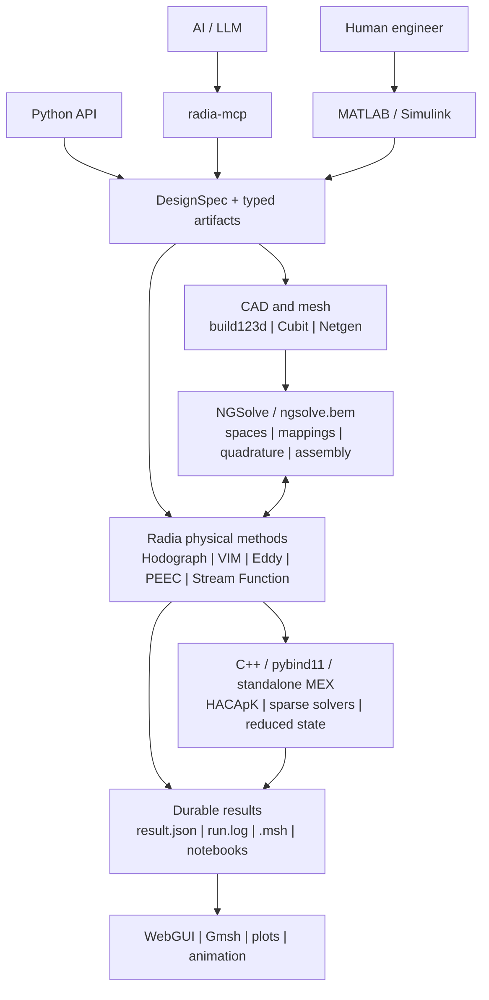

# Radia

<p align="center">
  <strong>AI-native electromagnetic CAE, built on NGSolve</strong><br>
  Design magnets, conductors, coils, open boundaries, reduced models, and
  coupled electromagnetic systems from Python, MCP, MATLAB, and Simulink.
</p>

<p align="center">
  <a href="https://github.com/ksugahar/Radia/actions/workflows/build-test.yml"></a>
  <a href="https://github.com/ksugahar/Radia/actions/workflows/radia-mcp-matrix.yml"></a>
  <a href="https://pypi.org/project/radia/"></a>
  <a href="https://pypi.org/project/radia-mcp/"></a>
  <a href="https://github.com/ksugahar/Radia/releases"></a>
  <a href="LICENSE"></a>
  <a href="https://github.com/ksugahar/Radia/stargazers"></a>
</p>

<p align="center">
  
</p>
<p align="center">
  <sub>Checked Gmsh post-processing artifacts: ray-cast field magnitude over
  STEP geometry and line-integral-convolution field flow.</sub>
</p>

**AI designs. Radia provides the engineering platform.**

Radia is an open-source electromagnetic engineering platform for moving from
geometry and physical intent to solved fields, optimized designs, dynamic
models, and durable result artifacts. It brings together analytical
open-boundary magnetics, high-order finite and boundary elements, scalable
integral operators, CAD and mesh workflows, optimization, visualization, and
human/AI interfaces.

Radia is deliberately **not** another monolithic finite-element solver. It is
built on [NGSolve](https://ngsolve.org/), which remains the numerical
foundation for finite-element spaces, mappings, quadrature, weak forms,
assembly, and field evaluation. Radia adds electromagnetic methods,
open-boundary operators, application workflows, native kernels, and
orchestration around that foundation.

> **Radia extends NGSolve; it does not compete with it.**

[Quick start](#quick-start) | [Capabilities](#capabilities) |
[Simulink](#simulink) | [MCP](#python-and-mcp) |
[Documentation](#documentation) | [Contributing](#contributing)

## Why Radia?

- **Design, not only solve.** Optimize pole faces, magnetic material,
  conductor topology, stream-function coils, reduced models, circuits, and
  controllers in one workflow.
- **Open boundaries are first-class.** Combine analytical source fields,
  Kelvin and DtN techniques, volume and boundary integral methods, SIBC, and
  model reduction without automatically surrounding every problem with a
  large air mesh.
- **AI and humans share the engineering contract.** Python and MCP are the
  first-class AI surface; MATLAB and masked Simulink blocks are the production
  human surface; both produce inspectable artifacts rather than hidden GUI
  state.
- **The numerical backend stays visible.** NGSolve owns finite-element
  mathematics. Radia supplies the missing physical operator or coupling and
  keeps independent analytical or integral routes where they improve trust.
- **Integration is a feature.** build123d, Coreform Cubit, Netgen, Gmsh,
  LTspice, MATLAB, Simulink, NumPy, SciPy, MKL, HACApK, and proven sparse
  solvers are connected through explicit boundaries instead of reimplemented.
- **Results carry evidence.** Production runs write checked meshes, logs,
  machine-readable result metadata, and visualization artifacts. Public
  examples are executed, result-bearing notebooks.

## What can you build?

| Engineering need | Radia route |
| :--- | :--- |
| Permanent magnets and coils | Analytical Radia source fields, CAD-driven coils, multipoles, forces, and open-space evaluation |
| Soft magnetic materials | HDiv-VIM, magnetic-moment and multipole-moment methods, nonlinear material laws, and HACApK charge-Gram operators |
| Accelerator and precision magnets | Clebsch-Hodograph pole design, field quality and multipoles, isochronous topology optimization, and charged-particle tracking |
| Eddy currents and shielding | NGSolve HCurl workflows, BEM-A, SIBC, ESIM, cohomology-aware formulations, and reduced transient models |
| Coil and current-sheet design | Stream-function inverse design, ACA+ / TSVD compression, contour extraction, and manufacturable single-stroke paths |
| Conductors and circuits | PEEC, proximity and skin effects, PRIMA/CLN reduction, SPICE export, KiCad/LTspice workflows, and circuit-field coupling |
| Induction heating | Geometry-to-operator assembly, distributed Eddy/Thermal Simulink blocks, temperature fields, and checked Gmsh outputs |
| Motors and magnetic levitation | Angle-periodic native reduced models, HCurl/CLN moving plants, Lorentz force, and Simulink control integration |
| Electromagnetic optimization | TPE, CMA-ES, MMA, SQP, adjoints, density/shape optimization, sheet-metal deformation, and CAD/mesh regeneration |
| Post-processing | Saved NGSolve WebGUI scenes, Gmsh field views, LIC, isosurfaces, streamlines, sweeps, and flying particle-orbit animations |

## Quick start

The current production wheel targets **Windows x64**, **Python 3.12**, and
**NGSolve/Netgen 6.2.2606**.

```powershell
python -m pip install --upgrade radia
```

Evaluate an analytical open-boundary magnetic field in SI units:

```python
import numpy as np
import radia as rad

mu0 = 4.0 * np.pi * 1e-7
remanence_t = 1.2

magnet = rad.ObjRecMag(
    [0.0, 0.0, 0.0],
    [0.01, 0.01, 0.01],
    [0.0, 0.0, remanence_t / mu0],
)

b_t = rad.Fld(magnet, "b", [0.0, 0.0, 0.02])
print(f"Bz [T] = {b_t[2]:.8f}")
rad.UtiDelAll()
```

```text
Bz [T] = 0.02356629
```

This first example needs no air mesh. Move to NGSolve when the problem needs
finite-element spaces, material domains, weak forms, or coupled field
equations.

Turn solved SI field samples into electromagnetic force and torque through
Lorentz volume integration, air-side Maxwell stress, time-averaged complex
phasors, virtual work/coenergy, or a cylindrical air-gap shear estimate:

```python
from radia.force import integrate_lorentz_force

# One quadrature sample: J = 2 MA/m^2 in +z, B = 0.3 T in +y,
# with 2.5 cm^3 of physical volume. The force points in -x.
force_n = integrate_lorentz_force(
    [0.0, 0.0, 2.0e6],
    [0.0, 0.3, 0.0],
    2.5e-6,
)
print(force_n)  # [-1.5, 0.0, 0.0] N
```

Supplying quadrature positions and a pivot to
`integrate_lorentz_force_and_torque` returns both resultants. The same
contracts are available in MATLAB under `radia.force`, including
`integrateLorentzForceTorque`, `integrateTimeAverageMaxwellSurfaceForceTorque`,
`virtualWorkForce`, and `coenergyTorque`.
The [force validation notebook](docs/force_validation/force_validation.ipynb)
shows the Lorentz, Maxwell-stress, and virtual-work identities used to check
signs and force extraction before attaching them to a production field solve.

Install only the integrations you need:

```powershell
# AI-facing domain tools and executable workflow knowledge
python -m pip install radia-mcp

# Coreform Cubit export and strict .vol checking
python -m pip install "radia[cubit]"
cubit-plugin-install
cubit-plugin-install --verify-only

# Optional accelerator tracking and topology-to-CAD workflows
python -m pip install "radia[beam]"
python -m pip install "radia[topopt-cad]"
```

See [Installation](#installation) for MATLAB/Simulink, visualization, and
source-build paths.

## Architecture



The same engineering model can therefore be driven by an AI agent, a Python
program, or a Simulink composition without making the user-facing interface
the source of numerical truth.

### Responsibility boundaries

| Layer | Owns |
| :--- | :--- |
| **NGSolve / ngsolve.bem** | FE spaces, element orientation, Piola maps, curved geometry, quadrature, weak-form assembly, GridFunctions, and BEM operators |
| **Radia C++ and Python** | Analytical fields, electromagnetic physical methods, open-boundary operators, material/circuit coupling, reduced models, and artifact schemas |
| **MATLAB and Simulink** | Human-facing composition, typed signal flow, lifecycle, controls, monitoring, and native MEX state ownership |
| **radia-mcp** | Executable domain knowledge, tool discovery, workflow selection, validation guidance, and AI orchestration |
| **CAD and visualization tools** | Geometry/mesh authoring and durable inspection through explicit STEP, VOL, MSH, and result boundaries |

## Capabilities

### Analytical and open-boundary magnetics

Radia retains the analytical magnetostatic strengths of the original Radia
project: permanent magnets, coils, source fields, forces, energies, and field
evaluation in open space. Around those sources, the current platform provides
Kelvin transformations, exterior DtN formulations, infinite elements,
equivalent sources, and integral formulations for problems where truncating a
large air domain is undesirable.

Radia targets the **magneto-quasi-static to Darwin regime**. Its propagation
kernels are Laplace kernels; frequency enters conductor physics through skin
depth, impedance, and reduced dynamics. Radia is not a full-wave Helmholtz
solver for radiation-dominated problems.

### Clebsch-Hodograph design

Hodograph methods transform selected nonlinear magnetic-design problems into
tractable design problems in a transformed coordinate space. The implementation
supports flux-line and pole-face design, field-quality studies, end effects,
and accelerator-magnet workflows.

- [Clebsch-Hodograph documentation](docs/clebsch_hodograph/README.md)
- [Result-bearing accelerator design notebooks](docs/clebsch_hodograph/demos/README.md)

### HDiv-VIM and magnetic materials

The HDiv Volume Integral Method uses NGSolve meshes and finite-element spaces
while Radia supplies the magnetic charge-Gram and open-boundary interaction.
The C++ HACApK path provides compressed operators for large repeated actions,
and the Python surface stays compatible with NGSolve's field and space
vocabulary.

This is Radia's forward path for soft magnetic materials, nonlinear
magnetization, demagnetizing fields, topology-aware material design, and
independent FEM/integral cross-checks.

- [HDiv-VIM documentation](docs/hdiv_vim/README.md)
- [Open-boundary method map](docs/open_boundary/OPEN_BOUNDARY_MAP.md)

### Eddy currents, SIBC, and ESIM

Radia combines high-order NGSolve HCurl discretizations with BEM-A, surface
impedance, effective surface impedance, cohomology handling, and reduced
models. The `Eddyable` concept packages response bases for repeated
low-frequency solves while preserving the underlying field formulation.

- [Eddy-current method guide](docs/solver/EDDY_CURRENT_METHODS.md)
- [ESIM formulation and usage](docs/esim/README.md)
- [Cauer Ladder Network documentation](docs/cln/CAUER_LADDER_NETWORK.md)

### Stream functions and coil topology

The stream-function layer solves inverse source problems for target magnetic
fields, supports regularized ACA+ / TSVD compression, extracts current
contours, and turns them into connected winding paths. It is used for planar,
cylindrical, and free-form current sheets as well as field-shaping and coil
optimization.

- [Stream Function documentation](docs/stream_function/README.md)
- [Single-stroke winding policy and algorithms](docs/stream_function/single_stroke.md)

### PEEC, circuits, and model reduction

PEEC workflows cover partial inductance, resistance, proximity and skin
effects, shield coupling, circuit assembly, and SPICE-compatible extraction.
PRIMA, block Lanczos, CLN, and universal relaxation networks provide reusable
reduced models for circuit and transient studies.

The built-in `radia.ltspice` package connects SPICE netlists, editable LTspice
schematics, KiCad-derived circuits, RAW results, and sampled-data Simulink
plants. Circuit conversion has one Python source of truth and exposes checked
MATLAB adapters.

- [PEEC integration](docs/peec_integration/README.md)
- [SPICE and LTspice integration](docs/ltspice/README.md)
- [Universal relaxation networks](docs/universal_relaxation_network/model_inventory.md)

### Optimization and geometry regeneration

Radia supports global, local, and gradient-based design loops:

- TPE, CMA-ES, GP, NSGA-II/III, QMC, and finite define-by-run search;
- MATLAB-native Optuna 4.9-style Study/Trial workflows, table-backed resume,
  automatic sampler routing, and live Pareto monitoring;
- analytic-adjoint MMA and SQP for continuous field optimization;
- HDiv-VIM and HCurl material topology;
- stream-function, sheet-metal, and electromagnet topology optimization;
- density/level-set to watertight STL and checked Cubit/Netgen mesh
  regeneration.

Optimization is tied to the same mesh, material, result, and provenance
contracts as direct analysis. A new geometry is not accepted merely because
an optimizer produced it.

### Accelerator fields and particle trajectories

Radia's C++ core provides inspectable SI field sampling, relativistic Lorentz
equations, RK4/Boris steps, fixed-step trajectories, and distributed R/T/U
transfer attribution. It can also hand solved magnetic fields to CERN Xsuite
for accelerator-coordinate tracking or use SciPy for adaptive trajectories,
event handling, and closed-orbit workflows. Gmsh exports preserve trajectory
quantities and can animate a beam through the solved field.

For high-order map analysis, NGSolve remains the source of truth for conforming
HCurl/HDiv projection and curved finite-element evaluation. Radia adds a
tracking-specialized CanonicalHCurl vacuum chain fitted from full-volume field
samples, with adaptive fringe grading, periodic ring closure, and direct
longitudinal-polynomial coupling to a nonautonomous fourth-order Lie-map
integrator. Independent canonical A-map and projected B-map Runge--Kutta routes
keep field-projection error separate from Lie truncation error.

<p align="center">
  
</p>

- [Executed particle-orbit notebook](docs/gmsh_post/em_particle_orbits.ipynb)
- [Native beam and transfer API design](docs/api/EARLY_TIMES_CPP_API_DESIGN.md)
- [Canonical HCurl and Lie-map validation](validation_test/ffag_topopt/README.md)
- [Gmsh post-processing guide](docs/gmsh_post/README.md)

## Interfaces

### Python and MCP

Python is the complete programmable API. MCP makes the same platform
discoverable and executable by AI agents.

The [radia-mcp package](packages/radia-mcp/) provides domain servers for Radia,
NGSolve, Cubit, Gmsh, build123d, PEEC, induction heating, optimization,
materials, electric machines, accelerator magnets, and supporting engineering
knowledge. It is intentionally lightweight at import time: knowledge and
contract tools can run without loading the full native Radia/NGSolve stack.

```powershell
python -m pip install radia-mcp
```

Treat `radia-mcp` as the executable operating manual for agent-driven work.
The top-level README explains the platform; MCP returns the current workflow,
arguments, prerequisites, failure modes, and validation route for a concrete
operation.

- [MCP package and client setup](packages/radia-mcp/README.md)
- [Generated MCP tool catalog](packages/radia-mcp/docs/TOOLS.md)

### MATLAB and native MEX

Selected NGSolve and Radia capabilities are available through independently
callable native MEX functions. Checked `uint64` handles own meshes, spaces,
coefficient and grid functions, forms, vectors, matrices, and repeated native
state without exposing raw pointers.

The standalone MEX ABI is both a user surface and a debugging boundary. It is
tested independently for numerical parity, error propagation, lifecycle, and
performance before a Simulink block depends on it. MATLAB wrappers use an
explicit Python-DLL boundary only where no stable native object boundary is
practical; Python is never silently called once per simulation time step.

HCurl-based reduced and topology workflows use the same standalone native
boundary. HCurl multifrequency topology gradients, activation derivatives,
and repeated reduced-state operations are available as independently testable
MEX commands before they are composed into Simulink blocks.

- [MATLAB integration and MEX contracts](matlab/README.md)
- [NGSolve/MEX parity map](docs/api/MATLAB_MEX_NGSOLVE_PARITY.md)

### Simulink

The final human-facing application interface is the single **Radia** Simulink
library. The current library contains:

| Group | Blocks |
| :--- | :--- |
| **Applications** | Electromagnet, Electromagnet Topology Optimization, PCB PEEC, Motor, Stream Function, Stream Function Optimization, Induction Heating, Magnetic Levitation, Field Study |
| **Material and coupling** | Temperature-Dependent BH, Material Database, Material Dictionary, Winding Dictionary, Field Study Configuration |
| **Optimization** | Optuna Optimization, Optuna Monitor, Sheet Metal Optimization, Adjoint Topology Optimization |
| **Reduced models and circuits** | Nonlinear HDiv-MMM Reactor, Motor Angle Family, LTspice Circuit, Hysteretic LTspice Plant |
| **Utilities** | Distributed-field statistics and checked result logging |

Register the library after adding the repository's `matlab` directory to the
MATLAB path:

```matlab
addpath("matlab")
radia.setup()
radia.simulink.buildLibrary()
sl_refresh_customizations
```

Application blocks use explicit triggers for expensive CAD, mesh, and field
solves. Native dynamic blocks use readable Level-2 MATLAB S-Functions for
ports and lifecycle, with standalone MEX handles for repeated numerical work.

The tracked `radia_nonlinear_reactor.slx` sample solves a nonlinear retained
HDiv magnetic-moment state at every accepted sample. It exposes terminal
voltage, flux linkage, differential inductance, peak and distributed magnetic
flux density, energy, and Newton diagnostics. The block uses no LUT, lumped
surrogate, or per-step Python call; open it with
`radia.simulink.openNonlinearReactor()`.

Induction Heating uses separate Eddy and Thermal S-Functions. Eddy accepts
current, workpiece angle, and distributed temperature and emits distributed
heat density; Thermal advances the accepted temperature field. Geometry
updates accept checked workpiece `.vol`/`.vol.gz` and coil STEP or labeled VOL
inputs, assemble the physical operators, and write evidence before simulation.
There is no LUT or lumped thermal substitute hidden behind the production
block.

Tracked `.slx` samples have canonical MATLAB builders and load/update
regressions. Packaged Simulink releases include the library, MATLAB support
files, MEX assets, runtime dependencies, a manifest, and checksums. The exact
archive is published only after it passes the multi-host release gate.

### Documentation and visualization

`docs/**/*.ipynb` is the public explanation and reproduction layer. Published
examples are executed notebooks with narrative, code, synchronized JSON, and
saved `ngsolve.webgui.Draw` or `netgen.webgui.Draw` scenes. They are not hidden
production workbenches.

Field-producing application runs write checked Gmsh `.msh v4.1` artifacts.
The Gmsh toolchain supports scalar/vector/tensor fields, sections, clipping,
isosurfaces, LIC, streamlines, file-series statistics, shared-camera
comparisons, and particle-track animation. Geometry is shown at physical
1:1:1 axis scale unless an explicit display exaggeration is recorded.

## Engineering contracts

Radia favors fail-loud, inspectable boundaries over convenient ambiguity.

| Contract | Rule |
| :--- | :--- |
| Units | Public geometry and field APIs use SI units; geometry is in meters and magnetic flux density is in tesla |
| Physical regime | Magneto-quasi-static to Darwin; Laplace propagation kernels, no hidden full-wave Helmholtz path |
| Finite elements | NGSolve owns orientation, mappings, quadrature, assembly, and GridFunction evaluation |
| Mesh interchange | Netgen `.vol` is the solver mesh boundary; STEP is geometry, not a labeled solver mesh |
| Mesh acceptance | Every solver-bound VOL passes `check-vol`; production modes add strict, versioned label contracts |
| Results | Runs write `run.log`, `result.json`, checks, hashes, and spatial `.msh` output where a field exists |
| Native state | MEX handles validate type, generation, ownership, and liveness; stale handles fail loudly |
| Release | Package versions, compatibility constants, source hashes, native assets, and Simulink archives are checked across independent hosts before publication |

For Cubit-to-NGSolve workflows, Cubit produces the mesh and Radia/NGSolve
consumes it. The exporter does not infer material constants from labels;
conductivity, permeability, BH data, frequency, and other physics remain
explicit configuration.

## Installation

### Supported production stack

| Component | Current target |
| :--- | :--- |
| Operating system | Windows 10/11 or Windows Server, x64 |
| Python core | 3.12 |
| Lightweight radia-mcp | Python 3.10-3.12 |
| NGSolve / Netgen | 6.2.2606 |
| MATLAB / Simulink package | R2026a, Windows x64 |
| Coreform Cubit | 2025.12, optional |
| Native build | Visual Studio 2022, CMake/Ninja, Intel MKL |

### Python packages

This monorepo contains three independently published packages. SPICE/LTspice
integration ships inside `radia`; its extra only adds schemdraw support.

| Package or extra | Install | Purpose |
| :--- | :--- | :--- |
| `radia` | `python -m pip install radia` | C++ core, Python APIs, NGSolve integration, physical methods, and application logic |
| `radia-mcp` | `python -m pip install radia-mcp` | AI-facing MCP servers and executable domain knowledge |
| `cubit-mesh-export` | `python -m pip install cubit-mesh-export` | Solver-neutral high-order Cubit export and `check-vol` |
| `radia[ltspice]` | `python -m pip install "radia[ltspice]"` | Radia plus schemdraw support for built-in SPICE/LTspice conversion and circuit coupling |

Pin release versions together when reproducing a validated deployment. Release
notes and immutable native/Simulink assets are published on the
[GitHub Releases page](https://github.com/ksugahar/Radia/releases).

### Build from source

```powershell
git clone https://github.com/ksugahar/Radia.git
Set-Location Radia
python -m pip install -e ".[dev]"
python -m pip install -e packages/radia-mcp
python -m pip install -e packages/cubit-mesh-export
pwsh -NoProfile -ExecutionPolicy Bypass -File .\Build.ps1 -RadiaOnly
```

See [BUILD.md](BUILD.md) for compiler, NGSolve, MKL, and packaging details.

## Repository map

```text
src/core/                       C++ Radia and native electromagnetic kernels
src/radia/                      Python package, NGSolve integration, methods
src/radia/ltspice/              SPICE, LTspice, KiCad, and circuit workflows
matlab/+radia/                  MATLAB API, MEX wrappers, Simulink builders
packages/radia-mcp/             MCP servers and executable domain knowledge
packages/cubit-mesh-export/     Cubit exporters, plugin, and check-vol
tests/                          Fast implementation regressions for CI
validation_test/                Numerical validation and research-grade gates
docs/                           Executed notebooks and technical references
tools/                          Build, policy, release, and verification tools
```

Loose `examples/` scripts are retired. New experiments begin outside the
repository and are promoted only when they become a reusable API, focused
test, validation problem, or result-bearing docs notebook.

## Documentation

Start with the path closest to your task:

- [Documentation index](docs/README.md)
- [Python API reference](docs/api/API_REFERENCE.md)
- [Radia and NGSolve integration notebook](docs/ngsolve_integration/integration_basics.ipynb)
- [Analytical electromagnetic formulas](docs/analytical_formulas.md)
- [HDiv-VIM](docs/hdiv_vim/README.md)
- [Clebsch-Hodograph](docs/clebsch_hodograph/README.md)
- [Eddy-current methods](docs/solver/EDDY_CURRENT_METHODS.md)
- [Stream Function](docs/stream_function/README.md)
- [PEEC integration](docs/peec_integration/README.md)
- [Induction heating](docs/induction_heating/README.md)
- [Electric machines](docs/electric_machine/README.md)
- [Magnetic levitation](docs/maglev/demos/README.md)
- [Gmsh post-processing](docs/gmsh_post/README.md)
- [MATLAB and Simulink](matlab/README.md)
- [MCP servers and tools](packages/radia-mcp/README.md)
- [Cubit mesh export](docs/cubit_mesh_export/README.md)

## Contributing

Radia welcomes focused contributions to physical methods, NGSolve-native
integration, independent validation, CAD/mesh boundaries, MATLAB/MEX parity,
documentation, and application workflows.

```powershell
# Run one focused regression while developing
python -m pytest -q tests/test_vim_eddy_hybrid.py

# Broaden only after the focused lane is green
python -m pytest -q tests
```

Fast regressions belong in `tests/`. Long numerical studies, convergence
sweeps, and benchmark-quality checks belong in `validation_test/`. Public
examples belong in executed notebooks under `docs/`.

- Read [CONTRIBUTING.md](CONTRIBUTING.md) before opening a pull request.
- Use the [issue tracker](https://github.com/ksugahar/Radia/issues) for bugs and
  concrete feature requests.
- Report vulnerabilities through the private process in
  [SECURITY.md](SECURITY.md).
- Include the smallest reproducible geometry/configuration and the generated
  `result.json` or checker report when reporting a numerical workflow issue.

If Radia is useful to your engineering or research, **star the repository**.
It helps other electromagnetic developers discover the project and follow its
progress.

## Project status

Radia is an active research and engineering platform. The core analytical
magnetostatics package is mature; newer VIM, Eddy, optimization, MATLAB/MEX,
and Simulink families are developed behind explicit tests and release gates.
Not every method has the same maturity or platform coverage, and unsupported
paths are expected to fail loudly rather than select a weaker substitute.

Current priorities are:

1. strengthen HDiv-VIM, topology optimization, and scalable open-boundary
   operators;
2. complete robust Hodograph and accelerator-magnet design workflows;
3. deepen Eddy, SIBC/ESIM, PEEC, CLN, and thermal coupling;
4. expand measured Python/MATLAB/MEX parity and native Simulink dynamics;
5. improve executed documentation, independent validation, and reproducible
   application artifacts.

## Heritage, acknowledgements, and license

Radia originates from the magnetostatics work developed by Oleg Chubar,
Pascal Elleaume, and collaborators at the European Synchrotron Radiation
Facility. The current project extends that heritage with NGSolve integration,
open-boundary engineering methods, high-order formulations, optimization,
native MATLAB/Simulink interfaces, and AI-oriented automation.

The platform depends on and respects the work of the
[NGSolve](https://ngsolve.org/) community. NGSolve is the source of truth for
finite-element mathematics in Radia workflows. Radia also integrates the
HACApK H-matrix library, sparseSolv, Netgen, Gmsh, build123d, Coreform Cubit,
and the broader Python/MATLAB scientific ecosystems.

The repository contains components under different compatible terms,
including the BSD-style Radia core, MIT-licensed HACApK, MPL-2.0 sparseSolv
integration, and redistributable runtime notices. See [LICENSE](LICENSE) for
the complete terms.
