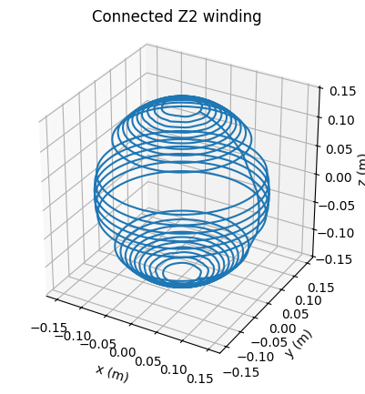
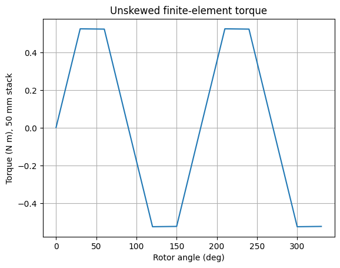
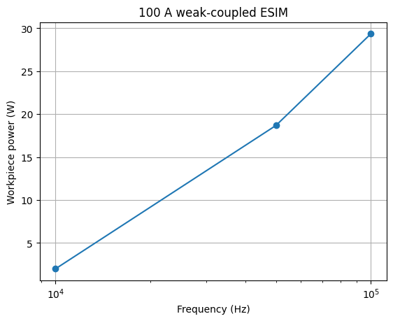
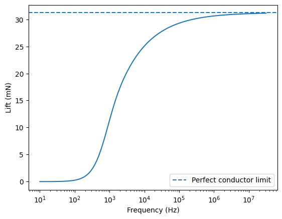
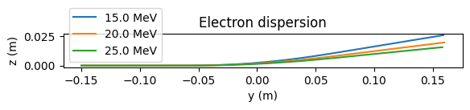
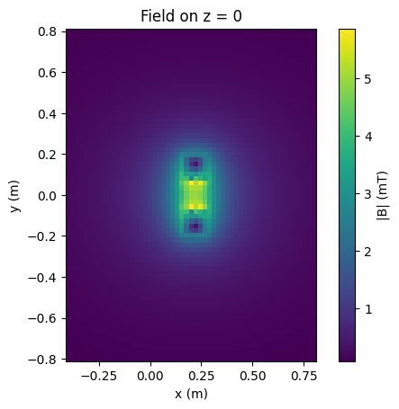
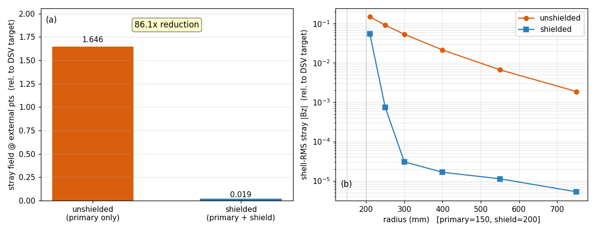

# Explore electromagnetic applications

Choose an engineering task, inspect a computed result, then follow its application
contract. These examples link to notebooks with saved outputs. Their scope
is stated alongside the result so you can decide what carries over to your model.

You choose the analysis task and judge its engineering meaning. MCP lets an AI
assistant operate supported tools along that workflow. The notebooks below
document calculations and results; they are not evidence of an autonomous AI
design run or a recorded MCP session.

[Start here](START_HERE.md) · [Accuracy and validation](VALIDATION_GUIDE.md) · [All documentation](README.md)

## Use a demonstrated capability

These pages introduce what Radia can do. For actual operation, use
[MCP tools](../packages/radia-mcp/README.md) or collaborate with AI through
[Cubit](cubit_mesh_export/README.md) and [Simulink](../matlab/README.md).
For executable samples, begin with [small test cases](../tests/README.md) or
[physics and application validation cases](../validation_test/README.md).
Each case retains its dependencies, assertions and demonstrated scope.

## Find the executable sample

| Capability | Small usage or contract sample | Physics/application sample |
| :--- | :--- | :--- |
| Coil geometry and field | [Finite-section coil field](../tests/test_coil_axis_closed_form.py) | [Stream-function verification](../validation_test/stream_function/README.md) |
| Periodic motor ROM | [Synthetic-table ROM tests](../tests/test_motor_rom.py) | [Machine-model and holdout checks](../validation_test/electric_machine/README.md) |
| Heat-source transfer | [Field artifact and transfer tests](../tests/test_ih_thermal_transfer.py) | [Electromagnetic/thermal operator checks](../validation_test/induction_heating/README.md#simulink-operator-physics-golden) |

These samples are related by capability; they do not all reproduce the exact
geometry in the gallery. Follow each case's dependencies, fixtures and assertions.
The [test sample guide](../tests/README.md#select-a-small-sample) explains what
the smaller cases check, and the
[validation sample guide](../validation_test/README.md#select-an-application-sample)
identifies the broader numerical scope.

## Browse results

Start with these six applications. Each notebook reads committed results from
the [numerical rerun lane](../validation_test/showcase/README.md), displays the
actual execution date and runtime, and redraws its figures. Run All does not
launch a solver. These are numerical runs, not recorded end-to-end MCP sessions.
Use MCP or Cubit/Simulink for operational work.

### Shape a coil for a target field

How does a desired field become a winding? Inspect the surface-current solution,
the connected wire and the field error after discretization in the
[coil notebook](stream_function/theory.ipynb). The preview is the spherical case;
the wider historical study is retained in the validation archive.

### Compare motor torque ripple

See how cogging torque varies with rotation and how skew changes the response in
the [motor cogging and skew notebook](electric_machine/cogging_skew_demo.ipynb).
Inspect the saved geometry and torque curves together with the skew conditions.
The [machine validation lane](../validation_test/electric_machine/README.md)
owns numerical checks.

### Inspect induction-heating power

Inspect how integrated workpiece power changes with frequency in the
[heating result notebook](esim_spatial/esim_spatial_demo.ipynb). This focused
rerun checks positive power and nonlinear convergence. It does not establish
local loss-density accuracy or a transient temperature distribution.

### Explore magnetic lift and force

The [magnetic-lift notebook](maglev/maglev_showcase.ipynb) introduces force and
response examples. Read the declared excitation and model assumptions alongside
the saved plots. A lift-force calculation alone does not establish stable,
controlled levitation.

### Bend particle trajectories with magnets

The [particle-orbit notebook](gmsh_post/em_particle_orbits.ipynb) shows particles
passing through coil and permanent-magnet fields. Inspect the geometry, initial
particle conditions and trajectories to understand bending and focusing.

### Build a complex coil and inspect its field

The [complex-coil notebook](complex_coil_geometry/complex_coil.ipynb) connects a
three-dimensional winding to its magnetic field. It introduces geometry and
field capability; the [small coil sample](../tests/test_coil_axis_closed_form.py)
checks a simpler finite-section coil against an analytical axis field.

## Go deeper

Detailed convergence studies, formulation comparisons and paper-supporting
experiments are organized through the
[validation study index](../validation_test/STUDY_INDEX.md). The sections below
provide supporting context, including reduced models and thermal verification.

## Read a result before choosing a method

| Design decision | Worked case | Main lesson |
| :--- | :--- | :--- |
| Is the connected winding accurate enough? | [Target field to winding](stream_function/theory.ipynb) | Check wire-path error after fitting the continuous current |
| Can the reduced model reproduce torque between sampled angles? | [Motor torque at held-out angles](electric_machine/angle_periodic_motor_rom.ipynb) | Compare flux, torque and energy using excluded operating points |
| Is the temperature rise consistent with the heat input? | [Thermal source and temperature check](induction_heating/axisymmetric_p2_thermal.ipynb) | Verify total power and an exact transient before coupled heating |

Each worked case states its geometry, conditions, saved result, interpretation
and reproduction route. Figures and values describe those configurations only.

## Design a coil for a target field

**Question:** What surface-current distribution produces a desired magnetic field?

- **Inputs:** coil surface, evaluation region, target field and regularization settings.
- **Inspect:** the [executed stream-function notebook](stream_function/theory.ipynb),
  then the [design, Pareto and manufacturing workflow](stream_function/application.md).
- **Outputs:** current distribution, field-error measures and winding contours;
  the manufacturing workflow connects contours to a wire representation.
- **Check:** evaluate the field again after contour extraction and wire construction.
  Agreement for a continuous current sheet does not establish winding accuracy.

The preview compares the illustrated shield configuration only. It is not a
universal shielding-performance or manufacturability claim.

## Connect conductors to circuits

**Question:** How do field effects in a conductor enter an electrical model?

- **Inputs:** conductor configuration, material properties and operating frequency range.
- **Inspect:** the [PEEC showcase](peec_integration/peec_showcase.ipynb), with
  saved Dowell and boundary-element demonstrations.
- **Continue:** use the [PEEC overview](peec_integration/README.md) and
  [SPICE interoperability guide](ltspice/README.md) for the selected circuit workflow.
- **Check:** frequency-band error, loss and circuit topology. A format conversion
  that preserves topology does not by itself validate a field approximation.

The showcase and circuit adapter are separate steps. Their presence does not
imply that every conductor geometry exports directly to every circuit simulator.

## Follow loss into temperature

**Question:** Is a deposited heat source transferred and integrated correctly?

- **Inputs:** axisymmetric domain, thermal properties, source field and time interval.
- **Inspect:** the [P2/Q2 thermal notebook](induction_heating/axisymmetric_p2_thermal.ipynb).
- **Outputs:** saved mesh and temperature scenes, a manufactured transient and
  conservative source-transfer checks.
- **Continue:** read the [induction-heating scope and acceptance notes](induction_heating/README.md).
- **Check:** energy transfer, temperature error and temporal/spatial refinement.

This thermal verification does not establish end-to-end acceptance of every
CAD-to-electromagnetic-to-thermal application. The application guide identifies
which production acceptance work remains separate.

## Inspect a reduced motor model

**Question:** Can a compact dynamic representation reproduce a selected machine's flux and torque?

- **Inputs:** machine cross-section, sampled angles, currents and declared operating conditions.
- **Inspect:** the [angle-periodic motor-ROM notebook](electric_machine/angle_periodic_motor_rom.ipynb).
- **Outputs:** holdout-angle comparisons and torque checks using different formulations.
- **Continue:** read the [electric-machine interfaces and qualification scope](electric_machine/README.md).
- **Check:** withheld operating points, torque consistency and energy behavior.

The illustrated qualification is a curved 2D cross-section study. Machine-specific
3D end regions require their own assessment; reduced-order accuracy should be
measured over the intended operating range.

## Learn the geometry-to-field foundation

**Question:** How do geometry, mesh, field and numerical operators fit together?

Start with the [NGSolve integration notebook](ngsolve_integration/integration_basics.ipynb).
For MATLAB, follow the [persistent mesh, space, form and matrix walkthrough](../matlab/README.md#persistent-mesh-space-form-and-matrix-handles).
The [backend map](../matlab/python_api_parity_manifest.json) distinguishes native
operations from explicit Python batch fallbacks. Interface availability is not
complete API parity.

## A useful application page answers five questions

When adding an application, keep its engineering question, inputs, visible result,
reproduction route and validation scope together. Include units and explain the
quantity used to judge success. Link to numerical evidence rather than duplicating
its numbers. Executable samples belong in `tests/` and `validation_test/`;
notebooks introduce capabilities through saved demonstrations. Link the MCP
or Cubit/Simulink operating route supported by the application.
