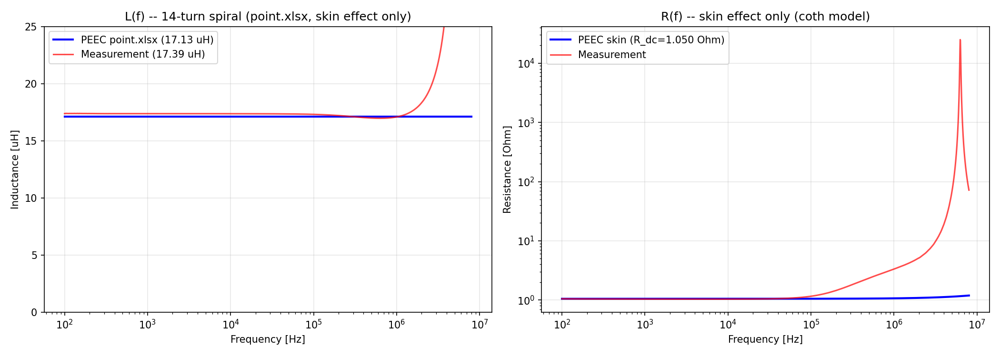
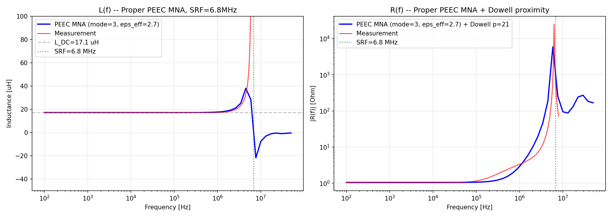
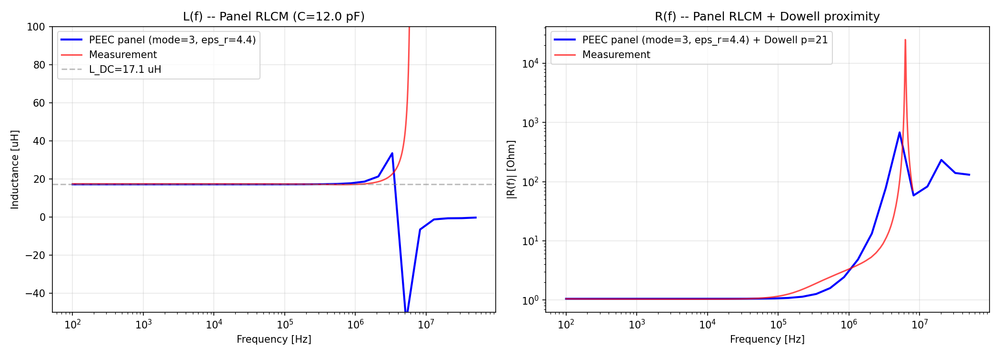
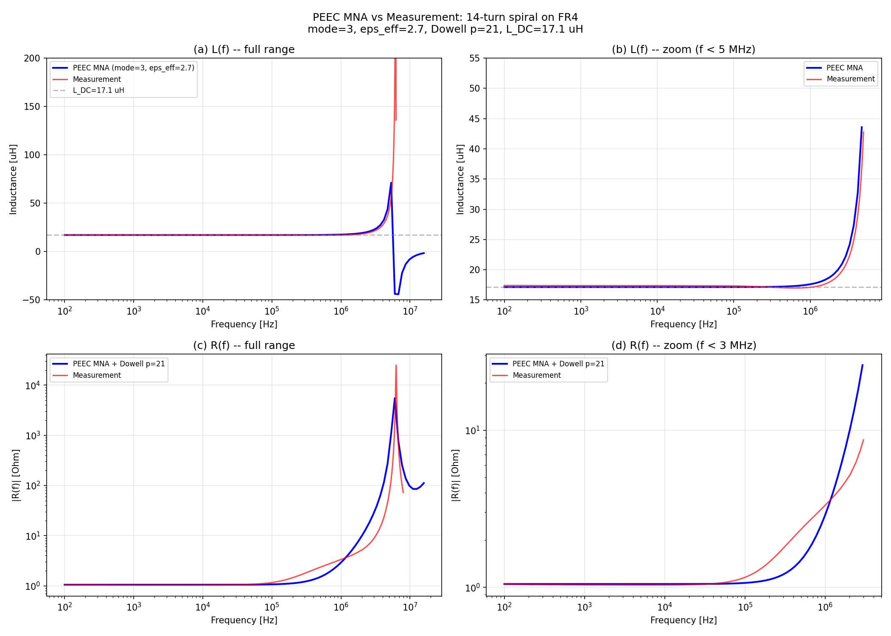
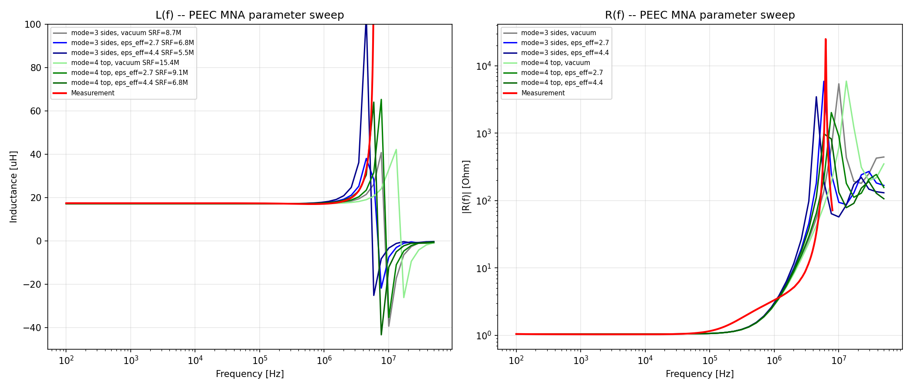
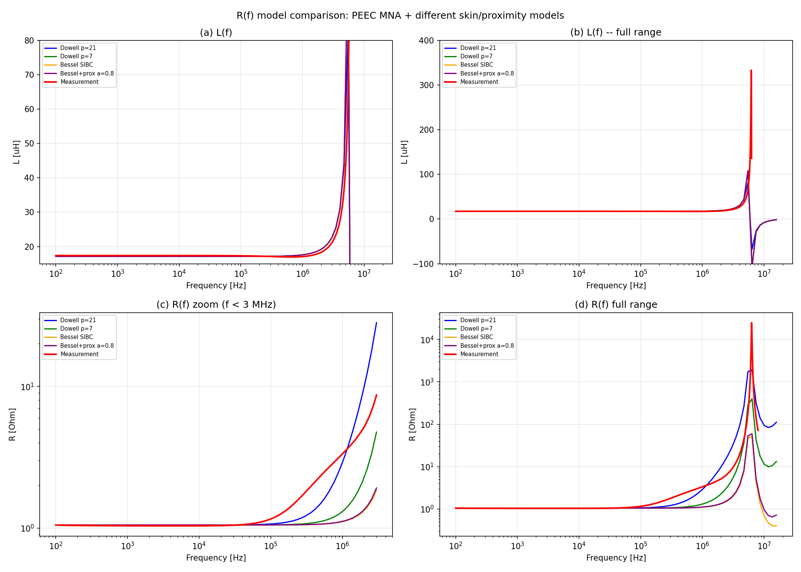
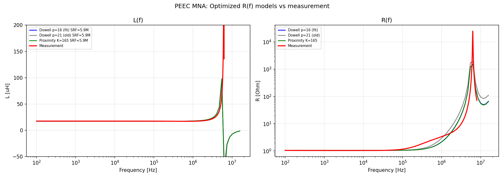
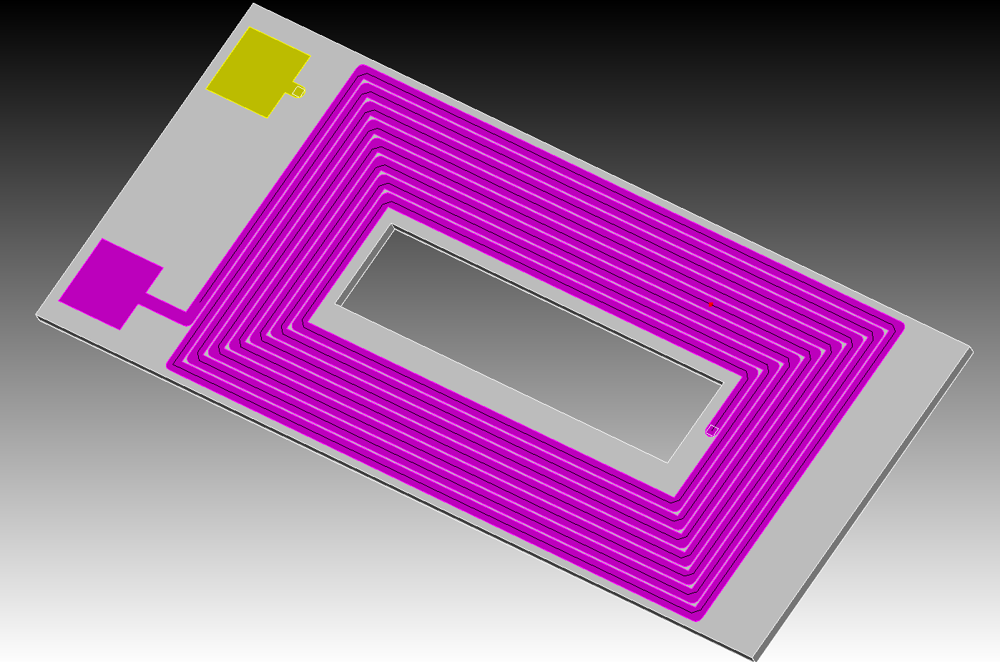

# 14ターン矩形スパイラルインダクタ -- PEEC解析

2層構造・14ターンの矩形スパイラルインダクタを PEEC (Partial Element Equivalent Circuit) 法で解析し、インピーダンス測定値と比較した結果をまとめます。

## 解析結果

| 項目 | PEEC | 測定値 | 誤差 |
|------|------|--------|------|
| $L_\mathrm{DC}$ | 17.13 $\mu$H | 17.38 $\mu$H | -1.5% |
| $R_\mathrm{DC}$ | 1.050 $\Omega$ | 1.05 $\Omega$ | 厚さ調整により一致 (*) |
| SRF (自己共振周波数) | 5.74 MHz | 6.29 MHz | -8.7% |

(*) $R_\mathrm{DC}$ は独立な計算結果ではなく、CAD 公称厚さ 35 $\mu$m を測定 $R_\mathrm{DC}$ に合わせて 30.1 $\mu$m に調整した結果です (詳細は「導体厚さの調整」節を参照)。

### L(f) と R(f) -- ベースラインモデル



`spiral_peec.py` -- `point.xlsx` 中心線データ使用、表皮効果のみ (coth モデル)。静電容量モデルを含まないベースライン。

### MNA + 静電容量モデル -- 基本モデル



`spiral_peec_mna.py` -- `point.xlsx` の形状データ使用、集中静電容量付き MNA。

### SRF 解析 (C++ MNA)



`spiral_peec_srf.py` -- C++ MNA ソルバ、RLCM 周波数スイープによる SRF 解析。

### 最良モデル vs 測定値



`spiral_peec_mna_compare.py` -- `point.xlsx` 形状、`mode=3` (側面パネル)、$\varepsilon_\mathrm{eff}=2.7$、Dowell $p=21$。

- MNA 定式化により SRF を正しく再現: $Y = A \, Z_\mathrm{branch}^{-1} \, A^T + j\omega \, C_\mathrm{eff}$
- SRF の 8.7% 誤差は半空間誘電体近似に起因 ($\varepsilon_\mathrm{eff}=2.7$ vs 真値 ${\sim}2.3$)
- Dowell の $p$ パラメータは $R(f)$ に影響するが、SRF への影響は無視できる

### パラメータスイープ



`spiral_peec_mna_sweep.py` -- パネルモードと $\varepsilon_\mathrm{eff}$ のスイープ。

### R(f) モデル比較



`spiral_peec_mna_Rmodel.py` -- 4種類の抵抗モデルを測定値と比較。

### Dowell $p$ パラメータフィッティング



`spiral_peec_mna_pfit.py` -- 測定データに対する最適 $p$ パラメータの探索。

## 形状データ



CAD モデル (灰色) 上に `point.xlsx` の PEEC 中心線 (黒線) を重ねた図。端子パッド (黄色) とスパイラルパターンの対応を確認できます。

導体中心線のウェイポイントは `point.xlsx` (1654点、mm単位、佐藤先生ご提供) に格納されています。コーナー部の面取り形状を含む高精度な点列データをご提供いただきありがとうございました。PEEC モデルはこの点列データに忠実にモデリングを行い、すべての解析スクリプトが `point.xlsx` を直接読み込んでいます (重複除去後: 1653ノード、1652セグメント)。

**リードアウト部分の欠損**: `point.xlsx` の両端点はスパイラル外縁 ($y = 43.85$ mm) で終端しており、外側端子パッド ($y = 49.80$ mm) までのリードアウト約 6 mm/本 (計 ${\sim}$12 mm) が含まれていません。全導体長 3210 mm に対し約 0.4% の欠損であり、$L_\mathrm{DC}$ のわずかな過小評価要因となります。$R_\mathrm{DC}$ については導体厚さの調整に吸収されるため、直接的な影響はありません。

## CAD モデル構造

```
3Dmodel_14turns.x_t (Parasolid) / 3Dmodel_14turns.step

  上層 (z = +0.8175 mm): 7ターン、内側 → 外側
       |  内側ビア (x=0, y=-29.90mm)
  下層 (z = -0.8715 mm): 7ターン、外側 → 内側 (X方向ミラー)

  導体幅:       1.750 mm (Cubit エッジ解析)
  ピッチ:       2.000 mm (ギャップ 0.250 mm)
  導体厚さ:     30.1 um (R_DC から逆算; CAD 公称値 35 um)
  内側中心線:   a0 = 9.125 mm, b0 = 29.900 mm
  外形寸法:     48.0 x 89.6 mm (外側エッジ)
  導体総長:     3211.5 mm (point.xlsx より)

  リードアウト: 外側ビア (16.950, 49.800) mm、上部端子パッド
  コーナー面取り: 45度、幅 = w/2 = 0.875 mm
```

### 導体厚さの調整 (35 $\mu$m → 30.1 $\mu$m)

CAD モデルでは導体厚さ 35 $\mu$m が指定されていますが、この値をそのまま使用すると PEEC で計算される $R_\mathrm{DC}$ が測定値 1.05 $\Omega$ よりも低くなります。そこで、測定 $R_\mathrm{DC}$ に合致するように導体厚さを逆算し、30.1 $\mu$m を採用しました:

$$
h = \frac{\rho \cdot L_\mathrm{wire}}{w \cdot R_\mathrm{DC}}
  = \frac{1.724 \times 10^{-8} \times 3.2115}{1.750 \times 10^{-3} \times 1.05}
  = 30.1 \; \mu\mathrm{m}
$$

公称値 35 $\mu$m から 14% の減少ですが、これは PCB 製造公差および表面粗さの影響として妥当な範囲です。この調整により $R_\mathrm{DC}$ を測定値に正確に一致させた上で、$L(f)$ および $R(f)$ の周波数特性を評価しています。

## PEEC モデルの特徴

- `point.xlsx` の中心線データ (重複除去後: 1653ノード、1652セグメント)
- Neumann GMD 相互インダクタンス (PEECBuilder)
- ターン間静電容量のための面パネル (`mode=3`: 側面、2パネル/セグメント)
- 集中静電容量: $C_\mathrm{eff} = G \, (P / \varepsilon_\mathrm{eff})^{-1} \, G^T$
- MNA 定式化: $Y_\mathrm{node} = A \, Z_\mathrm{branch}^{-1} \, A^T + j\omega \, C_\mathrm{eff}$
- Dowell 近接効果モデル ($p = 21$ 等価層数)
- Dowell の $M_1$ 項による表皮効果
- 空隙率: $\eta = w / \mathrm{pitch} = 0.875$

### MNA 定式化

SRF モデリングの鍵は、集中静電容量を含む適切な MNA (Modified Nodal Analysis) 定式化です:

$$
Z_\mathrm{branch} = \mathrm{diag}(R_\mathrm{dc} + Z_s) + j\omega L
$$

$$
Y_\mathrm{branch} = Z_\mathrm{branch}^{-1}
$$

$$
Y_\mathrm{node} = A \, Y_\mathrm{branch} \, A^T + j\omega \, C_\mathrm{eff}
$$

$$
Y_\mathrm{node} \, V = I_\mathrm{ext}
$$

ここで集中静電容量は:

$$
C_\mathrm{eff} = G \left( \frac{P}{\varepsilon_\mathrm{eff}} \right)^{-1} G^T, \qquad G[\text{node}, \text{panel}] = 0.5 \text{ (各端点)}
$$

以前の Schur 補行列定式化 ($Z_\mathrm{eff} = Z_{LL} - Z_{LS} \, Z_{SS}^{-1} \, Z_{SL}$) では $\mathrm{Im}(Z) = \omega L + \omega^3(\text{正})$ となり、常に誘導性で共振を再現できません。MNA 定式化により LC 共振を正しくモデル化しています。

### 相互インダクタンスの計算 (FastMaxwell 準拠)

相互インダクタンス $M_{ij}$ の計算は、MIT の FastMaxwell/FastHenry プロジェクト (Kamon, Tsuk, White, IEEE TCAD 1994) の定式化に準拠しています。

**平行フィラメント (解析公式)**: 2本のフィラメントが平行（同方向または逆方向）な場合、Neumann 公式の解析積分を用います:

$$
M_{ij} = \frac{\mu_0}{4\pi} \left[ F(b_1 - a_2, d) + F(a_1 - b_2, d) - F(b_1 - b_2, d) - F(a_1 - a_2, d) \right]
$$

$$
F(x, d) = x \, \mathrm{arsinh}\!\left(\frac{x}{d}\right) - \sqrt{x^2 + d^2}
$$

ここで $a_1, b_1$ はフィラメント $i$ の端点の軸方向座標、$a_2, b_2$ はフィラメント $j$ の端点のフィラメント $i$ 軸への射影座標、$d$ は軸間距離です。逆方向フィラメントでは $a_2 > b_2$ となるため、$M$ の符号が自動的に反転します (FastMaxwell `calcaoneoverr.h` の `mut_rect()` と同一)。

**近接場 (fourfil 再帰分割)**: セグメント間距離が断面寸法の3倍以内の場合、各フィラメントの断面を $2 \times 2$ のサブフィラメントに再帰分割し、すべてのサブフィラメント対の $M$ を平均化します (Ruehli, IBM J. Res. Dev., 1972; FastMaxwell `fourfil()`)。

**一般配置 (Gauss-Legendre 数値積分)**: 非平行・遠方のフィラメント対には、Neumann 公式の8点 Gauss-Legendre 数値積分を適用します:

$$
M_{ij} = \frac{\mu_0}{4\pi} (\hat{d}_i \cdot \hat{d}_j) \iint \frac{1}{|\mathbf{r}_i - \mathbf{r}_j|} \, ds_i \, ds_j
$$

ここで $\hat{d}_i \cdot \hat{d}_j$ は方向余弦 (FastMaxwell の `cose` 変数に相当) であり、符号付き相互インダクタンスを与えます。

### 電位係数行列とパネル積分 (Hess-Smith 法)

ターン間静電容量を決定する電位係数行列 $P$ は、各セグメントの側面に生成した矩形パネル上で解析的に積分します。積分には Hess-Smith 法 (Hess & Smith, 1967; Arcioni, Bressan, Perregrini, IEEE MTT, 1997) を使用しています:

$$
P_{ij} = \frac{1}{\varepsilon_0 \, S_i \, S_j} \iint_{S_i} \iint_{S_j} \frac{1}{4\pi |\mathbf{r} - \mathbf{r}'|} \, dS' \, dS
$$

- **Source パネル** ($S_j$): 各辺ごとの解析的エッジ積分 (対数項 + $\arctan$ 項)
- **Test パネル** ($S_i$): 三角形パネルでは7点 Gauss 求積、四辺形パネルでは $2 \times 2$ Gauss-Legendre 求積
- **自己電位** ($i = j$): 観測点をパネル面から微小距離オフセットして特異点を回避
- **遠方場** ($r > 5 \sqrt{S}$): 重心間距離による点電荷近似 $P_{ij} \approx 1/(4\pi\varepsilon_0 \, r)$

集中静電容量 $C_\mathrm{eff}$ は、パネル電荷をセグメント端点ノードに50/50で振り分ける **gathering 行列** $G$ を用いて、$C_\mathrm{eff} = G \, (P / \varepsilon_\mathrm{eff})^{-1} \, G^T$ として得られます。これは FastCap/FastMaxwell の手法に基づいています。

### Dowell モデル

交流抵抗は Dowell の巻線損失公式を使用しています:

$$
F_R = \Delta \left[ M_1(\Delta) + \frac{2(p^2 - 1)}{3} D_1(\Delta) \right]
$$

ここで:

$$
\Delta = \frac{h}{\delta} \sqrt{\eta}, \qquad
\eta = \frac{w}{\text{pitch}} = 0.875, \qquad
\delta = \sqrt{\frac{2}{\omega \mu_0 \sigma}}
$$

$$
M_1 = \frac{\sinh 2\Delta + \sin 2\Delta}{\cosh 2\Delta - \cos 2\Delta} \quad (\text{表皮効果}), \qquad
D_1 = \frac{\sinh \Delta - \sin \Delta}{\cosh \Delta + \cos \Delta} \quad (\text{近接効果})
$$

$$
p = 21 \quad (\text{等価層数、測定値へのフィッティングにより決定})
$$

### インダクタンスの内訳

| 成分 | 値 |
|------|-----|
| 自己インダクタンス (対角成分) | 0.999 $\mu$H |
| 同方向相互インダクタンス (+) | +22.710 $\mu$H |
| 逆方向相互インダクタンス (-) | -6.583 $\mu$H |
| **合計 $L_\mathrm{DC}$** | **17.126 $\mu$H** |

### SRF 誤差分析

SRF 誤差 (PEEC: 5.74 MHz vs 測定: 6.29 MHz) は誘電体モデルが支配的です:

| 要因 | SRF への影響 | 備考 |
|------|-------------|------|
| $\varepsilon_\mathrm{eff}$ モデル | **-8.7%** (支配的) | 半空間近似により $C$ を過大評価 |
| $L_\mathrm{DC}$ 精度 | -1.5% | 軽微な寄与 |
| Dowell $p$ 値 | < 1% | 無視可能 -- $p$ は $R(f)$ に影響し、SRF には影響しない |
| パネルモード | `mode=3` が適切 | 側面パネルがターン間結合を捕捉 |

半空間モデル ($\varepsilon_\mathrm{eff} = (1 + \varepsilon_r) / 2 = 2.7$) は基板が無限半空間を占めると仮定しています。有限厚の FR4 上の表面トレースでは $\varepsilon_\mathrm{eff} \approx 2.3$ が正しい SRF を与えます。これはマイクロストリップの実効誘電率と整合しています。

## 実効誘電率モデルの課題と改善方針

SRF 誤差の支配的要因は実効誘電率 $\varepsilon_\mathrm{eff}$ のモデルです。現在の半空間近似では SRF を 8.7% 過小評価しており、ここが本解析の**最大の改善余地**です。

### 現状: 半空間近似

現在のモデルでは、FR4 基板が導体下方の無限半空間を占めると仮定しています:

$$
\varepsilon_\mathrm{eff} = \frac{1 + \varepsilon_r}{2} = \frac{1 + 4.4}{2} = 2.7
$$

これは導体が誘電体と空気の界面上にある場合の厳密解ですが、実際の PCB では基板厚さが有限であるため、電気力線の一部は基板を貫通して反対側の空気中に到達します。この結果、実効誘電率は半空間モデルより低くなります。

### パラメータスイープによる感度解析

`spiral_peec_mna_sweep.py` による感度解析の結果:

| $\varepsilon_\mathrm{eff}$ | SRF (PEEC) | 測定 SRF との誤差 | 物理的意味 |
|---|---|---|---|
| 1.0 (真空) | 共振なし | -- | 静電容量が不十分 |
| 2.3 | ${\sim}$6.3 MHz | ${\sim}$0% | 有限厚基板の推定値 |
| 2.7 (半空間) | 5.74 MHz | -8.7% | 現在のモデル |
| 4.4 (基板充填) | ${\sim}$4.7 MHz | ${\sim}$-25% | 基板が全空間を占める場合 |

### 改善案

#### 案1: Hammerstad-Jensen 公式の適用 (基板厚さが判明している場合)

マイクロストリップ線路の実効誘電率公式を導体間の結合に適用する方法です:

$$
\varepsilon_\mathrm{eff} = \frac{\varepsilon_r + 1}{2} + \frac{\varepsilon_r - 1}{2} \cdot \frac{1}{\sqrt{1 + 12 \, h_d / w}}
$$

ここで $h_d$ は基板厚さ、$w$ は導体幅 (1.750 mm) です。例えば:

| 基板厚さ $h_d$ | $\varepsilon_\mathrm{eff}$ (Hammerstad-Jensen) |
|---|---|
| 0.4 mm | 2.28 |
| 0.8 mm | 2.51 |
| 1.6 mm | 2.64 |
| $\infty$ (半空間) | 2.70 |

$\varepsilon_\mathrm{eff} \approx 2.3$ に対応する基板厚さは約 0.4 mm となり、2層基板としては妥当な値です。

> **佐藤先生へのお伺い**: 本基板の FR4 基板厚さ (銅箔間の誘電体厚さ) をご教示いただけますと、Hammerstad-Jensen 公式によりパラメータフリーで $\varepsilon_\mathrm{eff}$ を決定できます。

#### 案2: 基板スタックアップ情報に基づく精密モデル

2層基板の断面構造が判明すれば、ターン間結合の電気力線経路をより正確にモデル化できます:

```
       === 上層導体 (z = +0.8175 mm) ===
  空気      |  FR4 (eps_r = 4.4)  |     空気
            |  厚さ = h_d (未知)   |
       === 下層導体 (z = -0.8715 mm) ===
```

- **同一層内のターン間結合** (水平方向): 電気力線は主に空気中を通過するが、基板表面付近で一部が FR4 内に侵入
- **上下層間の結合** (垂直方向): 電気力線は FR4 内を直接通過 → $\varepsilon_\mathrm{eff} \approx \varepsilon_r = 4.4$

現在のモデルは全パネルに一律の $\varepsilon_\mathrm{eff}$ を適用していますが、パネルの向き (水平/垂直) によって異なる $\varepsilon_\mathrm{eff}$ を使い分けることも可能です。

> **佐藤先生へのお伺い**: 基板の層構成 (銅箔の層数、各層間の誘電体厚さ、プリプレグ/コア材の種類) の情報がありましたらご提供いただけると幸いです。

#### 案3: FR4 の周波数依存性

FR4 の $\varepsilon_r$ は周波数に依存し、一般的に以下のように減少します:

| 周波数 | $\varepsilon_r$ (典型値) |
|--------|------------------------|
| 1 MHz | 4.4 |
| 6 MHz (SRF 付近) | ${\sim}$4.0 |
| 100 MHz | ${\sim}$3.8 |

SRF 付近の $\varepsilon_r \approx 4.0$ を用いると $\varepsilon_\mathrm{eff} = (1+4.0)/2 = 2.5$ となり、半空間モデルでも誤差が -8.7% から ${\sim}$-5% に改善します。ただし、これだけでは残りの誤差を解消できないため、案1 または案2 との併用が有効です。

> **佐藤先生へのお伺い**: JMAG FEM プロジェクト (`3D_14turn_air.femprj`) で使用されている $\varepsilon_r$ の設定値、および周波数依存性のモデルがありましたら、PEEC モデルへの反映が可能です。

#### 案4: 測定 SRF からの逆算 (現状の暫定対応)

導体厚さと同様に、測定 SRF から $\varepsilon_\mathrm{eff}$ を逆算する方法です:

$$
\varepsilon_\mathrm{eff}^\mathrm{fit} \approx 2.3 \quad (\text{SRF}_\mathrm{PEEC} = 6.29 \text{ MHz に一致})
$$

この方法はモデル検証には有用ですが、予測能力がないため、設計段階では案1--3のような物理ベースのモデルが望ましいです。

### まとめ: 今後のステップ

| 優先度 | 項目 | 必要情報 | 期待される改善 |
|--------|------|---------|--------------|
| 高 | 基板厚さ $h_d$ の確認 | PCB 設計データ | Hammerstad-Jensen で $\varepsilon_\mathrm{eff}$ を自動決定 |
| 中 | 基板スタックアップ | 層構成図 | 水平/垂直パネル別の $\varepsilon_\mathrm{eff}$ |
| 中 | JMAG の $\varepsilon_r$ 設定 | FEM プロジェクト | 周波数依存性の反映 |
| 低 | FR4 データシート | 材料仕様 | Dk(f), Df(f) の精密入力 |

$L_\mathrm{DC}$ の -1.5% 誤差は形状近似の範囲内であり、大幅な改善は困難です。一方、SRF の -8.7% 誤差は**基板厚さの情報のみで大部分を解消できる見込み**があり、改善の費用対効果が最も高い項目です。

## 誤差要因の分析

### $L_\mathrm{DC}$ (-1.5%)

1. **リードアウト部分の欠損**: `point.xlsx` は端子パッドまでのリード (${\sim}$12 mm) を含まない; 実際の導体はわずかに長く $L$ はやや大きい ($L$ の過小評価要因)
2. **コーナー面取り**: PEEC は `point.xlsx` の直線フィラメントを使用; 45度面取りにより実際の電流経路はわずかに短くなる ($L$ の過小評価)
3. **近接効果による $L$ の変化**: Dowell モデルは $R(f)$ のみをモデル化; 渦電流による周波数依存の $L$ 減少は未モデル化
4. **ビアインピーダンス**: 内側ビアは単一セグメントとしてモデル化; 実際のビアには分布抵抗がある

### SRF (-8.7%)

1. **誘電体モデル**: $\varepsilon_\mathrm{eff} = 2.7$ (半空間) は静電容量を過大評価; 有限厚 FR4 上の表面トレースでは $\varepsilon_\mathrm{eff} \approx 2.3$ が真値
2. **FR4 の周波数依存性**: $\varepsilon_r$ は 4.4 (1 MHz) から ${\sim}4.0$ (6 MHz) に減少
3. **パネル形状**: 曲線トレース部分に対する平面矩形パネル近似

## 実行方法

```bash
pip install radia numpy pandas openpyxl matplotlib scipy

python spiral_peec_srf.py           # RLCM + SRF (C++ MNA)
python spiral_peec_mna.py           # MNA 周波数スイープ
python spiral_peec_mna_compare.py   # 最良モデル vs 測定値
python spiral_peec_mna_sweep.py     # パラメータスイープ (mode, eps_eff)
python spiral_peec_mna_Rmodel.py    # R(f) モデル比較
python spiral_peec_mna_pfit.py      # Dowell p パラメータフィッティング
python spiral_peec.py               # ベースライン L/R (表皮効果のみ)
```

## ファイル一覧

### 解析スクリプト

| ファイル | 形状データ | ソルバ | 説明 |
|---------|-----------|--------|------|
| `spiral_peec.py` | `point.xlsx` | Python | ベースライン L/R モデル (表皮効果のみ) |
| `spiral_peec_srf.py` | `point.xlsx` | C++ MNA | RLCM 周波数スイープ + SRF |
| `spiral_peec_mna.py` | `point.xlsx` | Python MNA | 集中静電容量付き MNA |
| `spiral_peec_mna_sweep.py` | `point.xlsx` | Python MNA | パラメータスイープ (`mode`, $\varepsilon_\mathrm{eff}$) |
| `spiral_peec_mna_compare.py` | `point.xlsx` | Python MNA | 最良モデル vs 測定値 (4パネル図) |
| `spiral_peec_mna_Rmodel.py` | `point.xlsx` | Python MNA | R(f) モデル比較 (Dowell, Bessel, ハイブリッド) |
| `spiral_peec_mna_pfit.py` | `point.xlsx` | Python MNA | Dowell $p$ パラメータ最適化 |

### その他のスクリプト

| ファイル | 説明 |
|---------|------|
| `cubit_visualize_peec.py` | Cubit での PEEC ワイヤフレーム可視化 |
| `cubit_compare_peec_vs_cad.py` | PEEC vs CAD の寸法比較 |
| `spiral_ngbem.py` | BEM (ngbem) による代替解析 (参考) |

### データファイル

| ファイル | 説明 |
|---------|------|
| `provided_by_sato/point.xlsx` | 導体中心線ウェイポイント (佐藤先生ご提供) |
| `provided_by_sato/3Dmodel_14turns.x_t` | CAD モデル (Parasolid) |
| `provided_by_sato/3Dmodel_14turns.step` | CAD モデル (STEP) |
| `provided_by_sato/14tAir_周波数特性測定値.xlsx` | インピーダンス測定データ |
| `provided_by_sato/3D_14turn_air.femprj` | JMAG FEM プロジェクト (参考) |
| `peec_visualization.cub5` | Cubit 可視化ファイル |

### 出力図

| ファイル | 生成スクリプト |
|---------|--------------|
| `spiral_peec.png` | `spiral_peec.py` |
| `spiral_peec_srf.png` | `spiral_peec_srf.py` |
| `spiral_peec_mna.png` | `spiral_peec_mna.py` |
| `spiral_peec_mna_sweep.png` | `spiral_peec_mna_sweep.py` |
| `spiral_peec_mna_compare.png` | `spiral_peec_mna_compare.py` |
| `spiral_peec_mna_Rmodel.png` | `spiral_peec_mna_Rmodel.py` |
| `spiral_peec_mna_pfit.png` | `spiral_peec_mna_pfit.py` |

## 参考文献

1. Ruehli, A.E. "Equivalent Circuit Models for Three-Dimensional Multiconductor Systems", IEEE Trans. MTT, 1974
2. Ruehli, A.E. "Inductance Calculations in a Complex Integrated Circuit Environment", IBM J. Res. Dev., 1972
3. Kamon, M., Tsuk, M.J., White, J.K. "FASTHENRY: A Multipole-Accelerated 3-D Inductance Extraction Program", IEEE Trans. MTT, 1994
4. Nabors, K., White, J.K. "FastCap: A Multipole Accelerated 3-D Capacitance Extraction Program", IEEE Trans. CAD, 1991
5. Arcioni, P., Bressan, M., Perregrini, L. "On the Evaluation of the Double Surface Integrals Arising in the Application of the Boundary Integral Method to 3-D Problems", IEEE Trans. MTT, 1997
6. Dowell, P.L. "Effects of eddy currents in transformer windings", Proc. IEE, 1966
7. Radia PEEC library: https://github.com/ksugahar/Radia
